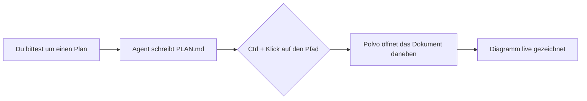
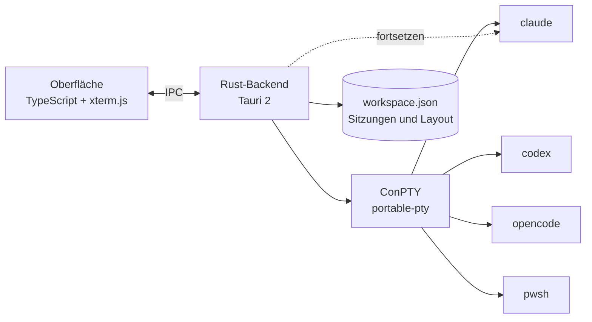

<p align="center">
  
</p>

<h1 align="center">Polvo</h1>

<p align="center"><b>Deine KI-Agenten, nebeneinander.</b><br>
Claude Code, Codex, OpenCode und Shells in einem nativen, schlanken und schönen Organizer für Windows.<br>
Ein Arm für jeden Agenten. 🐙</p>

<p align="center">🌐 <a href="README.md">English</a> · <a href="README.pt-BR.md">Português</a> · <a href="README.es.md">Español</a> · <a href="README.fr.md">Français</a> · <b>Deutsch</b> · <a href="README.it.md">Italiano</a> · <a href="README.ja.md">日本語</a> · <a href="README.zh-CN.md">简体中文</a> · <a href="README.ko.md">한국어</a> · <a href="README.ru.md">Русский</a></p>

<p align="center">
  <a href="https://github.com/felipeelopes/polvo/releases/latest">Download</a> ·
  <a href="#features">Funktionen</a> ·
  <a href="docs/ARCHITECTURE.md">Architektur (Portugiesisch)</a> ·
  <a href="#markdown-mermaid">Markdown und Mermaid</a> ·
  <a href="CONTRIBUTING.md">Mitwirken (Portugiesisch)</a>
</p>

---


## Warum Polvo?

Mehrere Agenten gleichzeitig laufen zu lassen, endet in einem Chaos aus Tabs und Fenstern. Polvo bringt alles an einen Ort:

- **Kacheln, die du ziehst und andockst**, an jeder Position, mit intelligenten Trennlinien.
- **Öffnet sich genau so wieder, wie du es verlassen hast**: Jede Unterhaltung wird vom jeweiligen CLI fortgesetzt (`claude --resume`, `codex resume`, `opencode --session`).
- **Nutzungslimits im Blick**: 5h- und Wochenfenster von Claude und Codex, Kosten von OpenCode.
- **Board nach Status**: Sieh auf einen Blick, wer arbeitet und wer **auf dich wartet**.

<a id="features"></a>
## Funktionen

| | |
|---|---|
| 🧩 **Kacheln** | Am Kopfbereich ziehen und am Rand einer anderen Kachel ablegen, um zu teilen, in der Mitte, um zu tauschen, am Rand der Fläche für eine ganze Spalte/Zeile. |
| 📐 **Intelligente Größenänderung** | Einrasten bei ⅓, ½ und ⅔, Ausrichtung an anderen Trennlinien, ausgerichtete Trennlinien, die sich gemeinsam bewegen, garantierte Mindestgröße und Live-Spalten × -Zeilen des Terminals. |
| ⚡ **Helfer** | Raster, Haupt + Stapel, Spalten, Zeilen, angleichen, rückgängig, maximieren, Tastenkürzel. |
| 🗂️ **Board** | Automatisches Kanban: *Wartet auf dich*, *Arbeitet*, *Untätig*, mit Live-Vorschau und Seitenfach zum Öffnen der Sitzung. Spalten in der Breite änderbar und einklappbar; der Chat kann maximiert werden. |
| 📁 **Projekte** | Öffne einen Ordner, erstelle ein Projekt (mit `git init`) oder klone ein Repository. „Nur dieses Projekt anzeigen“ filtert Kacheln und Board, jedes Projekt mit eigenem Layout. |
| 📝 **Markdown und Mermaid** | Dokument-Tabs neben den Sitzungen, mit Mermaid-Diagrammen, Formeln, Bearbeitung und Live-Aktualisierung. `Ctrl` + Klick auf eine `.md` im Terminal öffnet die Datei. [Siehe unten](#markdown-mermaid). |
| 🗂️ **Seitenleiste nach Projekt** | Sitzungen nach Repository gruppiert, jeweils mit ihren Worktrees. Der Chatname folgt dem Titel, den das CLI im Terminal setzt. |
| ⚡ **Neue Sitzung ohne Rückfragen** | Mit einem fokussierten Chat (`Ctrl+Shift+N`) oder über das „+“ eines Projekts/Worktrees öffnet sich die neue Sitzung direkt dort. |
| 🎨 **`/rename` und `/color`** | Der im CLI festgelegte Name und die Farbe erscheinen in Polvo, am Kachelrand und in der Seitenleiste. |
| 🖥️ **Mehrere Fenster** | Öffne so viele Fenster du willst und verschiebe jedes auf den richtigen Monitor. Polvo erneut zu öffnen erstellt ein weiteres Fenster. |
| 🔁 **Automatisches Fortsetzen** | Beim Öffnen kehren alle Fenster auf denselben Monitor zurück und jede Sitzung setzt dieselbe Unterhaltung fort (auch nach einem `/resume`). |
| 📊 **Nutzungslimits** | Claude mit zwei Ringen (wöchentlich außen, 5h innen), Codex (Sitzungsdateien), OpenCode (`opencode stats`). |
| 🧠 **Kontext pro Sitzung** | Jede Kachel zeigt, wie viel vom Kontextfenster die Unterhaltung bereits genutzt hat. |
| ⬆️ **CLI-Versionen** | Das Limits-Popup meldet, wenn es eine neue Version von Claude Code, Codex oder OpenCode gibt, und startet die Sitzungen mit der aktualisierten Version neu. |
| 🎛️ **Anbieter** | Deaktiviere Claude, Codex oder OpenCode, auch wenn sie installiert sind. |
| 🌍 **10 Sprachen** | Português, English, Español, Français, Deutsch, Italiano, 日本語, 简体中文, 한국어 und Русский. Folgt der Windows-Sprache oder der, die du in den Einstellungen wählst. |
| 🚀 **Startet mit Windows** und **aktualisiert sich selbst** über die GitHub-Releases. |

## In Aktion

**Board nach Status**: wer arbeitet, wer untätig ist und wer auf dich wartet, mit der Sitzung im Seitenfach geöffnet.


**Automatisches Fortsetzen**: Beim Öffnen kehrt jede Sitzung zur selben Unterhaltung zurück (der Oktopus holt sie zurück 🐙).


**Über**: Mitwirkende des Projekts aus der Git-Historie.


<a id="markdown-mermaid"></a>
## Markdown und Mermaid

Die Agenten schreiben Pläne, Specs und Berichte in Markdown. Polvo öffnet diese Dateien **neben den Sitzungen**, ohne die App zu verlassen:

- **`Ctrl` + Klick** auf einen beliebigen `.md`-Pfad im Terminal öffnet das Dokument in einem Tab.
- **Lesen, Bearbeiten und geteilte Ansicht** (CodeMirror-Editor), mit Syntaxhervorhebung, Tabellen, Fußnoten, GitHub-Hinweisen (`> [!NOTE]`) und KaTeX-Formeln (`$E = mc^2$`).
- **Mermaid-Diagramme** sofort gezeichnet: Flussdiagramme, Sequenz, Gantt, Klassen, Zustände, ER, Mindmap und mehr.
- **Live**: Wenn der Agent die Datei ändert, aktualisiert sich das Dokument von selbst.

Ein Block wie dieser, von einem Agenten in eine `PLAN.md` geschrieben…

````markdown

````

…erscheint gezeichnet in Polvo (und auch hier auf GitHub):


## Installation

1. Lade den `.exe`-Installer aus dem [neuesten Release](https://github.com/felipeelopes/polvo/releases/latest) herunter.
2. Halte mindestens eines der CLIs im `PATH` bereit: [Claude Code](https://docs.claude.com/claude-code), [Codex CLI](https://github.com/openai/codex) oder [OpenCode](https://opencode.ai). PowerShell funktioniert immer.
3. Öffne Polvo und beantworte die 3 Fragen des Onboardings.

Erfordert Windows 10 oder 11 (der Mica-Effekt erscheint unter Windows 11).

## Tastenkürzel

| Kürzel | Aktion |
|---|---|
| `Ctrl+Shift+N` | Neue Sitzung |
| `Ctrl+Shift+T` | Terminal (PowerShell) im Ordner der aktiven Sitzung |
| `Ctrl+Shift+1` / `Ctrl+Shift+2` | Kacheln / Board |
| `Ctrl+Alt+←↑→↓` | Fokus zwischen Kacheln wechseln |
| `Ctrl+Alt+Shift+←↑→↓` | Kachel verschieben |
| `Ctrl+Shift+M` | Kachel maximieren / wiederherstellen |
| `Ctrl+Shift+Z` | Layout rückgängig |
| `Ctrl +` / `Ctrl −` / `Ctrl 0` | Zoom der Oberfläche (wie in VS Code) |
| `Ctrl+C` mit Auswahl · `Ctrl+V` · Rechtsklick | Kopieren · Einfügen · Kopieren/Einfügen |

## So funktioniert es



- **Tauri 2** (Rust + WebView2): kleiner Installer und wenig Speicherverbrauch.
- **ConPTY** über [`portable-pty`](https://crates.io/crates/portable-pty): Jede Sitzung ist ein echtes Terminal.
- **xterm.js** (WebGL) rendert das Terminal, im Theme der App.
- Das Backend speichert die Sitzungen in `%APPDATA%\Polvo\workspace.json` und ermittelt die IDs jedes CLI, um sie später fortzusetzen.

Details in [docs/ARCHITECTURE.md](docs/ARCHITECTURE.md) (Portugiesisch).

## Entwicklung

Voraussetzungen: [Rust](https://rustup.rs) (MSVC-Toolchain), [Node 20+](https://nodejs.org), [pnpm](https://pnpm.io) und die Visual Studio Build Tools (C++).

```powershell
pnpm install
pnpm app:dev      # öffnet die App mit automatischem Neuladen
pnpm test         # Tests der Layout-Engine
pnpm check        # Typecheck + Tests + rustfmt + clippy
pnpm app:build    # erzeugt die Installer in src-tauri/target/release/bundle
pnpm release      # kompiliert, signiert und veröffentlicht das Release auf GitHub (siehe docs/RELEASING.md)
```

Beiträge sind sehr willkommen: Lies die [CONTRIBUTING.md](CONTRIBUTING.md) (Portugiesisch).

### Mitwirkende

<!-- contributors:start (gerado por scripts/contributors.mjs) -->
<table>
  <tr><td align="center"><a href="https://github.com/felipeelopes"><br><sub><b>Felipe Lopes</b></sub></a></td><td align="center"><a href="https://github.com/GabrielFranciscon"><br><sub><b>Gabriel Franciscon</b></sub></a></td></tr>
</table>
<!-- contributors:end -->

## Roadmap

- [ ] Eine Sitzung direkt von einem Fenster in ein anderes ziehen
- [ ] Themes (hell, hoher Kontrast) und konfigurierbare Schrift
- [ ] Windows-Benachrichtigungen, wenn ein Agent deine Aufmerksamkeit braucht
- [ ] Eigene Profile (Modell, Umgebungsvariablen, WSL)
- [ ] Denselben Prompt an mehrere Sitzungen senden

## Lizenz

[MIT](LICENSE). Polvo ist ein unabhängiges Projekt ohne Verbindung zu Anthropic, OpenAI oder OpenCode.
