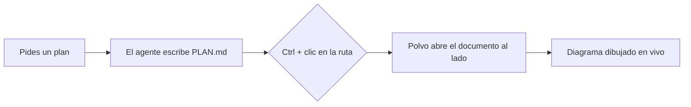
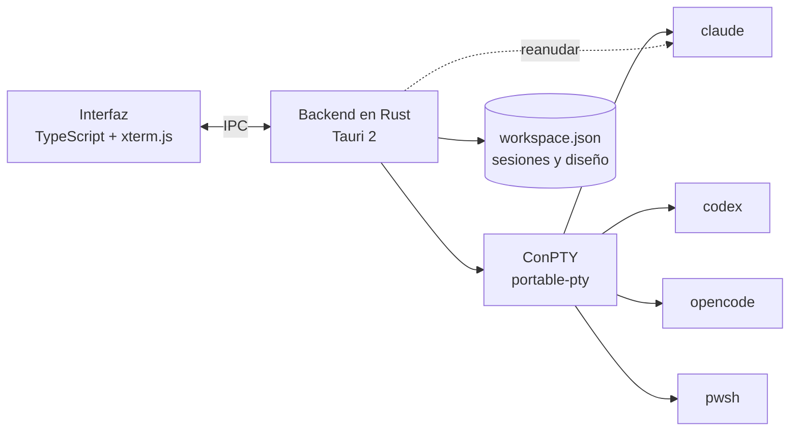

<p align="center">
  
</p>

<h1 align="center">Polvo</h1>

<p align="center"><b>Tus agentes de IA, lado a lado.</b><br>
Claude Code, Codex, OpenCode y shells en un organizador nativo, ligero y bonito para Windows.<br>
Un brazo para cada agente. 🐙</p>

<p align="center">🌐 <a href="README.md">English</a> · <a href="README.pt-BR.md">Português</a> · <b>Español</b> · <a href="README.fr.md">Français</a> · <a href="README.de.md">Deutsch</a> · <a href="README.it.md">Italiano</a> · <a href="README.ja.md">日本語</a> · <a href="README.zh-CN.md">简体中文</a> · <a href="README.ko.md">한국어</a> · <a href="README.ru.md">Русский</a></p>

<p align="center">
  <a href="https://github.com/felipeelopes/polvo/releases/latest">Descargar</a> ·
  <a href="#features">Funciones</a> ·
  <a href="docs/ARCHITECTURE.md">Arquitectura</a> ·
  <a href="#markdown-mermaid">Markdown y Mermaid</a> ·
  <a href="CONTRIBUTING.md">Contribuir</a>
</p>

---


## ¿Por qué Polvo?

Ejecutar varios agentes a la vez se convierte en un lío de pestañas y ventanas. Polvo lo reúne todo en un solo lugar:

- **Paneles que arrastras y encajas** en cualquier posición, con divisores inteligentes.
- **Se reabre tal como lo dejaste**: cada conversación la reanuda el propio CLI (`claude --resume`, `codex resume`, `opencode --session`).
- **Límites de uso a la vista**: ventana de 5h y semanal de Claude y Codex, coste de OpenCode.
- **Tablero por estado**: ve de un vistazo quién está trabajando y quién está **esperándote**.

<a id="features"></a>

## Funciones

| | |
|---|---|
| 🧩 **Paneles** | Arrastra por la cabecera y suelta en el borde de otro panel para dividirlo, en el centro para intercambiarlos o en el borde del área para una columna/fila completa. |
| 📐 **Redimensionado inteligente** | Imán en ⅓, ½ y ⅔, alineación con otros divisores, divisores alineados que se mueven juntos, tamaño mínimo garantizado y columnas × filas de la terminal en vivo. |
| ⚡ **Atajos de diseño** | Cuadrícula, principal + pila, columnas, filas, igualar, deshacer, maximizar, atajos de teclado. |
| 🗂️ **Tablero** | Kanban automático: *Esperándote*, *Trabajando*, *Inactivo*, con vista previa en vivo y un cajón para abrir la sesión. Columnas redimensionables y plegables; el chat se puede maximizar. |
| 📁 **Proyectos** | Abre una carpeta, crea un proyecto (con `git init`) o clona un repositorio. “Ver solo este proyecto” filtra Paneles y Tablero, y cada proyecto guarda su propio diseño. |
| 📝 **Markdown y Mermaid** | Pestañas de documentos junto a las sesiones, con diagramas Mermaid, fórmulas, edición y actualización en vivo. `Ctrl` + clic en un `.md` de la terminal abre el archivo. [Más abajo](#markdown-mermaid). |
| 🗂️ **Barra lateral por proyecto** | Sesiones agrupadas por repositorio, con los worktrees de cada uno. El nombre del chat sigue el título que el CLI define en la terminal. |
| ⚡ **Nueva sesión sin preguntas** | Con un chat enfocado (`Ctrl+Shift+N`) o desde el “+” de un proyecto/worktree, la sesión nueva se abre justo ahí. |
| 🎨 **`/rename` y `/color`** | El nombre y el color definidos en el CLI aparecen en Polvo, en el borde del panel y en la barra lateral. |
| 🖥️ **Varias ventanas** | Abre tantas ventanas como quieras y lleva cada una al monitor adecuado. Abrir Polvo de nuevo crea otra ventana. |
| 🔁 **Reanudación automática** | Al abrir, todas las ventanas vuelven al mismo monitor y cada sesión continúa la misma conversación (incluso después de un `/resume`). |
| 📊 **Límites de uso** | Claude con dos anillos (semanal por fuera, 5h por dentro), Codex (archivos de sesión), OpenCode (`opencode stats`). |
| 🧠 **Contexto por sesión** | Cada panel muestra cuánto de la ventana de contexto ha usado ya la conversación. |
| ⬆️ **Versiones de los CLI** | El popup de límites avisa cuando hay una versión nueva de Claude Code, Codex u OpenCode y reinicia las sesiones con ella. |
| 🎛️ **Proveedores** | Desactiva Claude, Codex u OpenCode aunque estén instalados. |
| 🌍 **10 idiomas** | Português, English, Español, Français, Deutsch, Italiano, 日本語, 简体中文, 한국어 y Русский. Sigue el idioma de Windows o el que elijas en Ajustes. |
| 🚀 **Se inicia con Windows** y **se actualiza solo** desde las releases de GitHub. |

## Míralo en acción

**Tablero por estado**: quién está trabajando, quién está inactivo y quién te está esperando, con la sesión abierta en el cajón.


**Reanudación automática**: al abrir, cada sesión vuelve a la misma conversación (el pulpo las trae de vuelta 🐙).


**Acerca de**: colaboradores del proyecto sacados del historial de git.


<a id="markdown-mermaid"></a>

## Markdown y Mermaid

Los agentes escriben planes, especificaciones e informes en Markdown. Polvo abre esos archivos **junto a las sesiones**, sin salir de la app:

- **`Ctrl` + clic** en cualquier ruta `.md` que aparezca en la terminal abre el documento en una pestaña.
- **Modos de lectura, edición y dividido** (editor CodeMirror), con resaltado de código, tablas, notas al pie, alertas de GitHub (`> [!NOTE]`) y fórmulas KaTeX (`$E = mc^2$`).
- **Diagramas Mermaid** dibujados al instante: diagramas de flujo, secuencia, Gantt, clases, estados, ER, mindmap y más.
- **En vivo**: cuando el agente modifica el archivo, el documento se actualiza solo.

Un bloque como este, escrito por un agente en un `PLAN.md`…

````markdown

````

…aparece dibujado en Polvo (y aquí en GitHub también):


## Instalación

1. Descarga el instalador `.exe` de la [última release](https://github.com/felipeelopes/polvo/releases/latest).
2. Ten al menos uno de los CLI en el `PATH`: [Claude Code](https://docs.claude.com/claude-code), [Codex CLI](https://github.com/openai/codex) u [OpenCode](https://opencode.ai). PowerShell funciona siempre.
3. Abre Polvo y responde las 3 preguntas de bienvenida.

Requiere Windows 10 u 11 (el efecto Mica aparece en Windows 11).

## Atajos

| Atajo | Acción |
|---|---|
| `Ctrl+Shift+N` | Nueva sesión |
| `Ctrl+Shift+T` | Terminal (PowerShell) en la carpeta de la sesión activa |
| `Ctrl+Shift+1` / `Ctrl+Shift+2` | Paneles / Tablero |
| `Ctrl+Alt+←↑→↓` | Mover el foco entre paneles |
| `Ctrl+Alt+Shift+←↑→↓` | Cambiar el panel de lugar |
| `Ctrl+Shift+M` | Maximizar / restaurar el panel |
| `Ctrl+Shift+Z` | Deshacer diseño |
| `Ctrl +` / `Ctrl −` / `Ctrl 0` | Zoom de la interfaz (como en VS Code) |
| `Ctrl+C` con selección · `Ctrl+V` · clic derecho | Copiar · pegar · copiar/pegar |

## Cómo funciona



- **Tauri 2** (Rust + WebView2): instalador pequeño y poco consumo de memoria.
- **ConPTY** vía [`portable-pty`](https://crates.io/crates/portable-pty): cada sesión es una terminal real.
- **xterm.js** (WebGL) renderiza la terminal, con el tema de la app.
- El backend guarda las sesiones en `%APPDATA%\Polvo\workspace.json` y descubre los ids de cada CLI para reanudarlas después.

Detalles en [docs/ARCHITECTURE.md](docs/ARCHITECTURE.md) (en portugués).

## Desarrollo

Requisitos: [Rust](https://rustup.rs) (toolchain MSVC), [Node 20+](https://nodejs.org), [pnpm](https://pnpm.io) y las Build Tools de Visual Studio (C++).

```powershell
pnpm install
pnpm app:dev      # abre la app con recarga automática
pnpm test         # pruebas del motor de diseño
pnpm check        # typecheck + pruebas + rustfmt + clippy
pnpm app:build    # genera los instaladores en src-tauri/target/release/bundle
pnpm release      # compila, firma y publica la release en GitHub (ver docs/RELEASING.md)
```

Las contribuciones son muy bienvenidas: lee [CONTRIBUTING.md](CONTRIBUTING.md) (en portugués).

### Colaboradores

<!-- contributors:start (gerado por scripts/contributors.mjs) -->
<table>
  <tr><td align="center"><a href="https://github.com/felipeelopes"><br><sub><b>Felipe Lopes</b></sub></a></td><td align="center"><a href="https://github.com/GabrielFranciscon"><br><sub><b>Gabriel Franciscon</b></sub></a></td></tr>
</table>
<!-- contributors:end -->

## Hoja de ruta

- [ ] Arrastrar una sesión directamente de una ventana a otra
- [ ] Temas (claro, alto contraste) y fuente configurable
- [ ] Notificaciones de Windows cuando un agente necesite tu atención
- [ ] Perfiles personalizados (modelo, variables de entorno, WSL)
- [ ] Enviar el mismo prompt a varias sesiones

## Licencia

[MIT](LICENSE). Polvo es un proyecto independiente, sin vínculo con Anthropic, OpenAI ni OpenCode.
