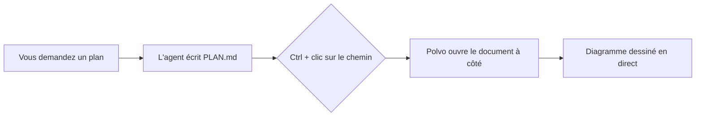
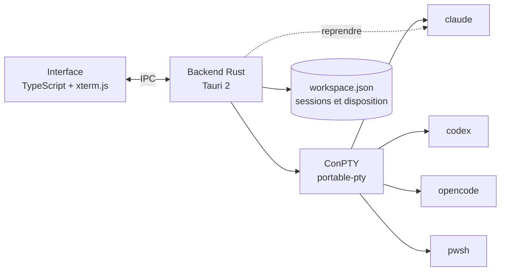

<p align="center">
  
</p>

<h1 align="center">Polvo</h1>

<p align="center"><b>Vos agents IA, côte à côte.</b><br>
Claude Code, Codex, OpenCode et shells dans un organiseur natif, léger et élégant pour Windows.<br>
Un bras pour chaque agent. 🐙</p>

<p align="center">🌐 <a href="README.md">English</a> · <a href="README.pt-BR.md">Português</a> · <a href="README.es.md">Español</a> · <b>Français</b> · <a href="README.de.md">Deutsch</a> · <a href="README.it.md">Italiano</a> · <a href="README.ja.md">日本語</a> · <a href="README.zh-CN.md">简体中文</a> · <a href="README.ko.md">한국어</a> · <a href="README.ru.md">Русский</a></p>

<p align="center">
  <a href="https://github.com/felipeelopes/polvo/releases/latest">Télécharger</a> ·
  <a href="#features">Fonctionnalités</a> ·
  <a href="docs/ARCHITECTURE.md">Architecture</a> ·
  <a href="#markdown-mermaid">Markdown et Mermaid</a> ·
  <a href="CONTRIBUTING.md">Contribuer</a>
</p>

---


## Pourquoi Polvo ?

Faire tourner plusieurs agents en même temps tourne vite au fouillis d'onglets et de fenêtres. Polvo rassemble tout au même endroit :

- **Des panneaux que vous faites glisser et emboîtez** n'importe où, avec des séparateurs intelligents.
- **Se rouvre exactement comme vous l'avez laissé** : chaque conversation est reprise par le CLI lui-même (`claude --resume`, `codex resume`, `opencode --session`).
- **Limites d'utilisation bien visibles** : fenêtre de 5 h et hebdomadaire de Claude et Codex, coût d'OpenCode.
- **Tableau par statut** : voyez d'un coup d'œil qui travaille et qui **vous attend**.

<a id="features"></a>

## Fonctionnalités

| | |
|---|---|
| 🧩 **Panneaux** | Faites glisser par l'en-tête et déposez sur le bord d'un autre panneau pour le diviser, au centre pour les échanger, sur le bord de la zone pour une colonne/ligne entière. |
| 📐 **Redimensionnement intelligent** | Aimant à ⅓, ½ et ⅔, alignement sur les autres séparateurs, séparateurs alignés qui bougent ensemble, taille minimale garantie et colonnes × lignes du terminal en direct. |
| ⚡ **Dispositions rapides** | Grille, principal + pile, colonnes, lignes, égaliser, annuler, agrandir, raccourcis clavier. |
| 🗂️ **Tableau** | Kanban automatique : *Vous attend*, *Au travail*, *Inactif*, avec aperçu en direct et un tiroir pour ouvrir la session. Colonnes redimensionnables et repliables ; le chat peut être agrandi. |
| 📁 **Projets** | Ouvrez un dossier, créez un projet (avec `git init`) ou clonez un dépôt. « Voir seulement ce projet » filtre Panneaux et Tableau, chaque projet gardant sa propre disposition. |
| 📝 **Markdown et Mermaid** | Des onglets de documents à côté des sessions, avec diagrammes Mermaid, formules, édition et mise à jour en direct. `Ctrl` + clic sur un `.md` du terminal ouvre le fichier. [Voir plus bas](#markdown-mermaid). |
| 🗂️ **Barre latérale par projet** | Sessions regroupées par dépôt, avec les worktrees de chacun. Le nom du chat suit le titre que le CLI définit dans le terminal. |
| ⚡ **Nouvelle session sans questions** | Avec un chat actif (`Ctrl+Shift+N`) ou via le « + » d'un projet/worktree, la nouvelle session s'ouvre directement là. |
| 🎨 **`/rename` et `/color`** | Le nom et la couleur définis dans le CLI apparaissent dans Polvo, sur la bordure du panneau et dans la barre latérale. |
| 🖥️ **Plusieurs fenêtres** | Ouvrez autant de fenêtres que vous voulez et placez chacune sur le bon écran. Relancer Polvo ouvre une nouvelle fenêtre. |
| 🔁 **Reprise automatique** | À l'ouverture, toutes les fenêtres reviennent sur le même écran et chaque session poursuit la même conversation (même après un `/resume`). |
| 📊 **Limites d'utilisation** | Claude avec deux anneaux (hebdomadaire à l'extérieur, 5 h à l'intérieur), Codex (fichiers de session), OpenCode (`opencode stats`). |
| 🧠 **Contexte par session** | Chaque panneau indique quelle part de la fenêtre de contexte la conversation a déjà utilisée. |
| ⬆️ **Versions des CLI** | La fenêtre des limites signale une nouvelle version de Claude Code, Codex ou OpenCode et redémarre les sessions dessus. |
| 🎛️ **Fournisseurs** | Désactivez Claude, Codex ou OpenCode même s'ils sont installés. |
| 🌍 **10 langues** | Português, English, Español, Français, Deutsch, Italiano, 日本語, 简体中文, 한국어 et Русский. Suit la langue de Windows ou celle que vous choisissez dans Réglages. |
| 🚀 **Démarre avec Windows** et **se met à jour tout seul** depuis les releases GitHub. |

## En action

**Tableau par statut** : qui travaille, qui est inactif et qui vous attend, avec la session ouverte dans le tiroir.


**Reprise automatique** : à l'ouverture, chaque session revient à la même conversation (la pieuvre les ramène 🐙).


**À propos** : les contributeurs du projet, tirés de l'historique git.


<a id="markdown-mermaid"></a>

## Markdown et Mermaid

Les agents rédigent plans, specs et rapports en Markdown. Polvo ouvre ces fichiers **à côté des sessions**, sans quitter l'application :

- **`Ctrl` + clic** sur n'importe quel chemin `.md` affiché dans le terminal ouvre le document dans un onglet.
- **Modes lecture, édition et divisé** (éditeur CodeMirror), avec coloration du code, tableaux, notes de bas de page, alertes GitHub (`> [!NOTE]`) et formules KaTeX (`$E = mc^2$`).
- **Diagrammes Mermaid** dessinés à la volée : organigrammes, séquence, Gantt, classes, états, ER, mindmap et plus encore.
- **En direct** : quand l'agent modifie le fichier, le document se met à jour tout seul.

Un bloc comme celui-ci, écrit par un agent dans un `PLAN.md`…

````markdown

````

…apparaît dessiné dans Polvo (et ici sur GitHub aussi) :


## Installation

1. Téléchargez l'installateur `.exe` depuis la [dernière release](https://github.com/felipeelopes/polvo/releases/latest).
2. Ayez au moins un des CLI dans le `PATH` : [Claude Code](https://docs.claude.com/claude-code), [Codex CLI](https://github.com/openai/codex) ou [OpenCode](https://opencode.ai). PowerShell fonctionne toujours.
3. Ouvrez Polvo et répondez aux 3 questions d'accueil.

Nécessite Windows 10 ou 11 (l'effet Mica apparaît sous Windows 11).

## Raccourcis

| Raccourci | Action |
|---|---|
| `Ctrl+Shift+N` | Nouvelle session |
| `Ctrl+Shift+T` | Terminal (PowerShell) dans le dossier de la session active |
| `Ctrl+Shift+1` / `Ctrl+Shift+2` | Panneaux / Tableau |
| `Ctrl+Alt+←↑→↓` | Déplacer le focus entre les panneaux |
| `Ctrl+Alt+Shift+←↑→↓` | Échanger la position du panneau |
| `Ctrl+Shift+M` | Agrandir / restaurer le panneau |
| `Ctrl+Shift+Z` | Annuler la disposition |
| `Ctrl +` / `Ctrl −` / `Ctrl 0` | Zoom de l'interface (comme dans VS Code) |
| `Ctrl+C` avec sélection · `Ctrl+V` · clic droit | Copier · coller · copier/coller |

## Comment ça marche



- **Tauri 2** (Rust + WebView2) : petit installateur et faible consommation de mémoire.
- **ConPTY** via [`portable-pty`](https://crates.io/crates/portable-pty) : chaque session est un vrai terminal.
- **xterm.js** (WebGL) affiche le terminal, avec le thème de l'application.
- Le backend enregistre les sessions dans `%APPDATA%\Polvo\workspace.json` et récupère les identifiants de chaque CLI pour les reprendre plus tard.

Détails dans [docs/ARCHITECTURE.md](docs/ARCHITECTURE.md) (en portugais).

## Développement

Prérequis : [Rust](https://rustup.rs) (toolchain MSVC), [Node 20+](https://nodejs.org), [pnpm](https://pnpm.io) et les Build Tools de Visual Studio (C++).

```powershell
pnpm install
pnpm app:dev      # ouvre l'application avec rechargement automatique
pnpm test         # tests du moteur de disposition
pnpm check        # typecheck + tests + rustfmt + clippy
pnpm app:build    # génère les installateurs dans src-tauri/target/release/bundle
pnpm release      # compile, signe et publie la release sur GitHub (voir docs/RELEASING.md)
```

Les contributions sont les bienvenues : lisez [CONTRIBUTING.md](CONTRIBUTING.md) (en portugais).

## Feuille de route

- [ ] Faire glisser une session directement d'une fenêtre à une autre
- [ ] Thèmes (clair, contraste élevé) et police configurable
- [ ] Notifications Windows quand un agent a besoin de votre attention
- [ ] Profils personnalisés (modèle, variables d'environnement, WSL)
- [ ] Envoyer le même prompt à plusieurs sessions

## Licence

[MIT](LICENSE). Polvo est un projet indépendant, sans lien avec Anthropic, OpenAI ou OpenCode.
