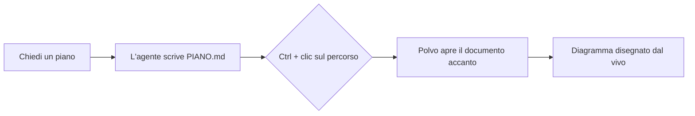
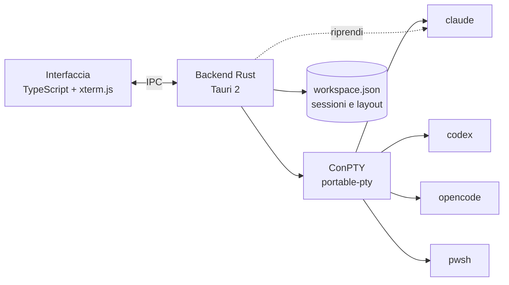

<p align="center">
  
</p>

<h1 align="center">Polvo</h1>

<p align="center"><b>I tuoi agenti IA, fianco a fianco.</b><br>
Claude Code, Codex, OpenCode e shell in un organizzatore nativo, leggero e bello per Windows.<br>
Un braccio per ogni agente. 🐙</p>

<p align="center">🌐 <a href="README.md">English</a> · <a href="README.pt-BR.md">Português</a> · <a href="README.es.md">Español</a> · <a href="README.fr.md">Français</a> · <a href="README.de.md">Deutsch</a> · <b>Italiano</b> · <a href="README.ja.md">日本語</a> · <a href="README.zh-CN.md">简体中文</a> · <a href="README.ko.md">한국어</a> · <a href="README.ru.md">Русский</a></p>

<p align="center">
  <a href="https://github.com/felipeelopes/polvo/releases/latest">Scarica</a> ·
  <a href="#features">Funzionalità</a> ·
  <a href="docs/ARCHITECTURE.md">Architettura (in portoghese)</a> ·
  <a href="#markdown-mermaid">Markdown e Mermaid</a> ·
  <a href="CONTRIBUTING.md">Contribuire (in portoghese)</a>
</p>

---


## Perché Polvo?

Far girare più agenti contemporaneamente diventa un caos di schede e finestre. Polvo riunisce tutto in un solo posto:

- **Pannelli che trascini e agganci** in qualsiasi posizione, con divisori intelligenti.
- **Si riapre esattamente come l'hai lasciato**: ogni conversazione viene ripresa dalla propria CLI (`claude --resume`, `codex resume`, `opencode --session`).
- **Limiti di utilizzo sempre in vista**: finestra di 5h e settimanale di Claude e Codex, costo di OpenCode.
- **Bacheca per stato**: vedi a colpo d'occhio chi sta lavorando e chi è **in attesa di te**.

<a id="features"></a>
## Funzionalità

| | |
|---|---|
| 🧩 **Pannelli** | Trascina dall'intestazione e rilascia sul bordo di un altro pannello per dividerlo, al centro per scambiarli, sul bordo dell'area per un'intera colonna/riga. |
| 📐 **Ridimensionamento intelligente** | Magnete a ⅓, ½ e ⅔, allineamento con gli altri divisori, divisori allineati che si muovono insieme, dimensione minima garantita e colonne × righe del terminale in tempo reale. |
| ⚡ **Scorciatoie di layout** | Griglia, principale + pila, colonne, righe, uguaglia, annulla, ingrandisci, scorciatoie da tastiera. |
| 🗂️ **Bacheca** | Kanban automatico: *In attesa di te*, *Al lavoro*, *Inattive*, con anteprima dal vivo e cassetto per aprire la sessione. Colonne ridimensionabili e comprimibili; la chat può essere ingrandita. |
| 📁 **Progetti** | Apri una cartella, crea un progetto (con `git init`) o clona un repository. “Mostra solo questo progetto” filtra Pannelli e Bacheca, ogni progetto con la sua disposizione. |
| 📝 **Markdown e Mermaid** | Schede di documenti accanto alle sessioni, con diagrammi Mermaid, formule, modifica e aggiornamento dal vivo. `Ctrl` + clic su un `.md` nel terminale apre il file. [Vedi sotto](#markdown-mermaid). |
| 🗂️ **Barra laterale per progetto** | Sessioni raggruppate per repository, ciascuno con i suoi worktree. Il nome della chat segue il titolo che la CLI imposta nel terminale. |
| ⚡ **Nuova sessione senza domande** | Con una chat attiva (`Ctrl+Shift+N`) o dal “+” di un progetto/worktree, la nuova sessione si apre direttamente lì. |
| 🎨 **`/rename` e `/color`** | Il nome e il colore definiti nella CLI compaiono in Polvo, sul bordo del pannello e nella barra laterale. |
| 🖥️ **Più finestre** | Apri quante finestre vuoi e porta ciascuna sul monitor giusto. Riaprire Polvo crea un'altra finestra. |
| 🔁 **Ripresa automatica** | All'apertura, tutte le finestre tornano sullo stesso monitor e ogni sessione continua la stessa conversazione (anche dopo un `/resume`). |
| 📊 **Limiti di utilizzo** | Claude con due anelli (settimanale all'esterno, 5h all'interno), Codex (file di sessione), OpenCode (`opencode stats`). |
| 🧠 **Contesto per sessione** | Ogni pannello mostra quanta parte della finestra di contesto la conversazione ha già usato. |
| ⬆️ **Versioni delle CLI** | Il popup dei limiti avvisa quando c'è una nuova versione di Claude Code, Codex o OpenCode e riavvia le sessioni con la versione aggiornata. |
| 🎛️ **Provider** | Disattiva Claude, Codex o OpenCode anche se sono installati. |
| 🌍 **10 lingue** | Português, English, Español, Français, Deutsch, Italiano, 日本語, 简体中文, 한국어 e Русский. Segue la lingua di Windows o quella che scegli nelle Impostazioni. |
| 🚀 **Si avvia con Windows** e **si aggiorna da solo** dalle release su GitHub. |

## Guardalo in azione

**Bacheca per stato**: chi sta lavorando, chi è inattivo e chi è in attesa di te, con la sessione aperta nel cassetto.


**Ripresa automatica**: all'apertura, ogni sessione torna alla stessa conversazione (il polpo le riporta indietro 🐙).


**Informazioni**: i collaboratori del progetto ricavati dalla cronologia di git.


<a id="markdown-mermaid"></a>
## Markdown e Mermaid

Gli agenti scrivono piani, specifiche e report in Markdown. Polvo apre questi file **accanto alle sessioni**, senza uscire dall'app:

- **`Ctrl` + clic** su qualsiasi percorso `.md` che compare nel terminale apre il documento in una scheda.
- **Lettura, modifica e modalità divisa** (editor CodeMirror), con evidenziazione del codice, tabelle, note a piè di pagina, avvisi di GitHub (`> [!NOTE]`) e formule KaTeX (`$E = mc^2$`).
- **Diagrammi Mermaid** disegnati al volo: diagrammi di flusso, sequenza, Gantt, classi, stati, ER, mindmap e altri.
- **Dal vivo**: quando l'agente modifica il file, il documento si aggiorna da solo.

Un blocco come questo, scritto da un agente in un `PIANO.md`…

````markdown

````

…appare disegnato in Polvo (e anche qui su GitHub):


## Installazione

1. Scarica l'installer `.exe` dall'[ultima release](https://github.com/felipeelopes/polvo/releases/latest).
2. Tieni almeno una delle CLI nel `PATH`: [Claude Code](https://docs.claude.com/claude-code), [Codex CLI](https://github.com/openai/codex) o [OpenCode](https://opencode.ai). PowerShell funziona sempre.
3. Apri Polvo e rispondi alle 3 domande dell'onboarding.

Richiede Windows 10 o 11 (l'effetto Mica compare su Windows 11).

## Scorciatoie

| Scorciatoia | Azione |
|---|---|
| `Ctrl+Shift+N` | Nuova sessione |
| `Ctrl+Shift+T` | Terminale (PowerShell) nella cartella della sessione attiva |
| `Ctrl+Shift+1` / `Ctrl+Shift+2` | Pannelli / Bacheca |
| `Ctrl+Alt+←↑→↓` | Sposta il focus tra i pannelli |
| `Ctrl+Alt+Shift+←↑→↓` | Scambia il pannello di posto |
| `Ctrl+Shift+M` | Ingrandisci / ripristina il pannello |
| `Ctrl+Shift+Z` | Annulla layout |
| `Ctrl +` / `Ctrl −` / `Ctrl 0` | Zoom dell'interfaccia (come in VS Code) |
| `Ctrl+C` con selezione · `Ctrl+V` · tasto destro | Copia · incolla · copia/incolla |

## Come funziona



- **Tauri 2** (Rust + WebView2): installer piccolo e poca memoria.
- **ConPTY** tramite [`portable-pty`](https://crates.io/crates/portable-pty): ogni sessione è un vero terminale.
- **xterm.js** (WebGL) disegna il terminale, con il tema dell'app.
- Il backend salva le sessioni in `%APPDATA%\Polvo\workspace.json` e ricava gli id di ogni CLI per riprenderle in seguito.

Dettagli in [docs/ARCHITECTURE.md](docs/ARCHITECTURE.md) (in portoghese).

## Sviluppo

Prerequisiti: [Rust](https://rustup.rs) (toolchain MSVC), [Node 20+](https://nodejs.org), [pnpm](https://pnpm.io) e i Build Tools di Visual Studio (C++).

```powershell
pnpm install
pnpm app:dev      # apre l'app con ricaricamento automatico
pnpm test         # test del motore di layout
pnpm check        # typecheck + test + rustfmt + clippy
pnpm app:build    # genera gli installer in src-tauri/target/release/bundle
pnpm release      # compila, firma e pubblica la release su GitHub (vedi docs/RELEASING.md)
```

I contributi sono benvenutissimi: leggi il [CONTRIBUTING.md](CONTRIBUTING.md) (in portoghese).

### Contributori

<!-- contributors:start (gerado por scripts/contributors.mjs) -->
<table>
  <tr><td align="center"><a href="https://github.com/felipeelopes"><br><sub><b>Felipe Lopes</b></sub></a></td><td align="center"><a href="https://github.com/GabrielFranciscon"><br><sub><b>Gabriel Franciscon</b></sub></a></td></tr>
</table>
<!-- contributors:end -->

## Roadmap

- [ ] Trascinare una sessione direttamente da una finestra all'altra
- [ ] Temi (chiaro, alto contrasto) e font configurabile
- [ ] Notifiche di Windows quando un agente richiede la tua attenzione
- [ ] Profili personalizzati (modello, variabili d'ambiente, WSL)
- [ ] Inviare lo stesso prompt a più sessioni

## Licenza

[MIT](LICENSE). Polvo è un progetto indipendente, senza legami con Anthropic, OpenAI o OpenCode.
