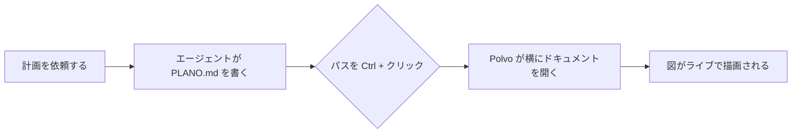
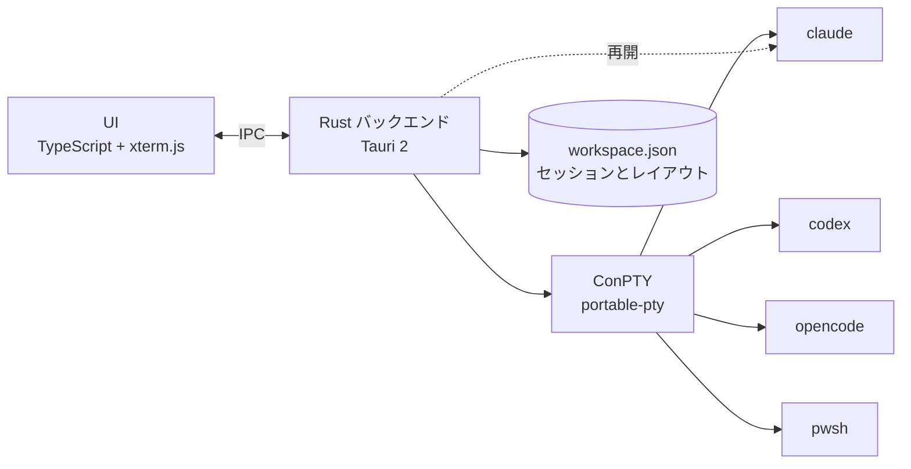

<p align="center">
  
</p>

<h1 align="center">Polvo</h1>

<p align="center"><b>AI エージェントを、横に並べて。</b><br>
Claude Code、Codex、OpenCode、シェルをまとめて扱える、軽くて美しい Windows ネイティブのオーガナイザー。<br>
エージェントごとに 1 本の腕を。🐙</p>

<p align="center">🌐 <a href="README.md">English</a> · <a href="README.pt-BR.md">Português</a> · <a href="README.es.md">Español</a> · <a href="README.fr.md">Français</a> · <a href="README.de.md">Deutsch</a> · <a href="README.it.md">Italiano</a> · <b>日本語</b> · <a href="README.zh-CN.md">简体中文</a> · <a href="README.ko.md">한국어</a> · <a href="README.ru.md">Русский</a></p>

<p align="center">
  <a href="https://github.com/felipeelopes/polvo/releases/latest">ダウンロード</a> ·
  <a href="#features">機能</a> ·
  <a href="docs/ARCHITECTURE.md">アーキテクチャ (ポルトガル語)</a> ·
  <a href="#markdown-mermaid">Markdown と Mermaid</a> ·
  <a href="CONTRIBUTING.md">コントリビュート (ポルトガル語)</a>
</p>

---


## なぜ Polvo?

複数のエージェントを同時に動かすと、タブとウィンドウがすぐに散らかります。Polvo はそれをひとつにまとめます:

- **ドラッグしてはめ込めるパネル**をどこにでも配置でき、区切り線もスマートです。
- **閉じたときのまま再び開きます**: 各会話は CLI 自身の機能で再開されます (`claude --resume`、`codex resume`、`opencode --session`)。
- **使用量の制限がひと目でわかる**: Claude と Codex の 5 時間枠と週間枠、OpenCode のコスト。
- **ステータス別ボード**: 誰が作業中で、誰が**あなたの応答待ち**かがひと目でわかります。

<a id="features"></a>

## 機能

| | |
|---|---|
| 🧩 **パネル** | ヘッダーをドラッグし、別のパネルの端にドロップで分割、中央で入れ替え、エリアの端で列/行全体を作成。 |
| 📐 **スマートなリサイズ** | ⅓、½、⅔ へのスナップ、他の区切り線との整列、揃った区切り線の連動、最小サイズの保証、ターミナルの列 × 行をライブ表示。 |
| ⚡ **便利な配置** | グリッド、メイン + スタック、列、行、均等化、元に戻す、最大化、キーボードショートカット。 |
| 🗂️ **ボード** | 自動カンバン: *応答待ち*、*作業中*、*アイドル*。ライブプレビューとセッションを開くドロワー付き。列はサイズ変更・折りたたみ可能で、チャットは最大化できます。 |
| 📁 **プロジェクト** | フォルダーを開く、プロジェクトを作成する (`git init` 付き)、リポジトリをクローンする。「このプロジェクトのみ表示」でパネルとボードを絞り込み、プロジェクトごとにレイアウトを保持。 |
| 📝 **Markdown と Mermaid** | セッションの横にドキュメントのタブを表示。Mermaid 図、数式、編集、ライブ更新に対応。ターミナル上の `.md` を `Ctrl` + クリックで開けます。[詳しくは下記](#markdown-mermaid)。 |
| 🗂️ **プロジェクト別サイドバー** | セッションをリポジトリごとにまとめ、それぞれの worktree も表示。チャット名は CLI がターミナルに設定するタイトルに追従します。 |
| ⚡ **質問なしで新しいセッション** | チャットにフォーカスした状態で (`Ctrl+Shift+N`)、またはプロジェクト/worktree の「+」から、新しいセッションがその場で開きます。 |
| 🎨 **`/rename` と `/color`** | CLI で設定した名前と色が、Polvo のパネルの枠とサイドバーに反映されます。 |
| 🖥️ **複数ウィンドウ** | ウィンドウを好きなだけ開き、それぞれを好きなモニターに配置。Polvo をもう一度開くと別のウィンドウが作られます。 |
| 🔁 **自動再開** | 起動すると、すべてのウィンドウが同じモニターに戻り、各セッションは同じ会話を続けます (`/resume` の後でも)。 |
| 📊 **使用量の制限** | Claude は 2 つのリング (外側が週間、内側が 5 時間)、Codex (セッションファイル)、OpenCode (`opencode stats`)。 |
| 🧠 **セッションごとのコンテキスト** | 各パネルに、会話がコンテキストウィンドウをどれだけ使ったかを表示。 |
| ⬆️ **CLI のバージョン** | Claude Code、Codex、OpenCode の新バージョンがあると使用量ポップアップでお知らせし、更新後のバージョンでセッションを再起動します。 |
| 🎛️ **プロバイダー** | Claude、Codex、OpenCode はインストール済みでも無効にできます。 |
| 🌍 **10 言語** | Português、English、Español、Français、Deutsch、Italiano、日本語、简体中文、한국어、Русский。Windows の言語に従うか、設定で選べます。 |
| 🚀 **Windows と一緒に起動**し、GitHub のリリースから**自動で更新**します。 |

## 動作の様子

**ステータス別ボード**: 誰が作業中で、誰がアイドルで、誰があなたの応答を待っているか。セッションはドロワーで開けます。


**自動再開**: 起動すると、各セッションが同じ会話に戻ります (タコが引き戻してくれます 🐙)。


**About**: git の履歴から集めたプロジェクトのコントリビューター。


<a id="markdown-mermaid"></a>

## Markdown と Mermaid

エージェントは計画、仕様、レポートを Markdown で書きます。Polvo はそれらのファイルを、アプリを離れずに**セッションの横に**開きます:

- ターミナルに表示された `.md` パスを **`Ctrl` + クリック**すると、ドキュメントがタブで開きます。
- **閲覧、編集、分割モード** (CodeMirror エディター)。コードのハイライト、表、脚注、GitHub のアラート (`> [!NOTE]`)、KaTeX の数式 (`$E = mc^2$`) に対応。
- **Mermaid 図**をその場で描画: フローチャート、シーケンス図、ガントチャート、クラス図、状態図、ER 図、マインドマップなど。
- **ライブ更新**: エージェントがファイルを変更すると、ドキュメントも自動で更新されます。

エージェントが `PLANO.md` に書いた、このようなブロックが…

````markdown

````

…Polvo で (そしてここ GitHub でも) 図として表示されます:


## インストール

1. [最新リリース](https://github.com/felipeelopes/polvo/releases/latest)から `.exe` インストーラーをダウンロードします。
2. 少なくとも 1 つの CLI を `PATH` に用意します: [Claude Code](https://docs.claude.com/claude-code)、[Codex CLI](https://github.com/openai/codex)、または [OpenCode](https://opencode.ai)。PowerShell は常に使えます。
3. Polvo を開き、オンボーディングの 3 つの質問に答えます。

Windows 10 または 11 が必要です (Mica 効果は Windows 11 で表示されます)。

## ショートカット

| ショートカット | 操作 |
|---|---|
| `Ctrl+Shift+N` | 新しいセッション |
| `Ctrl+Shift+T` | アクティブなセッションのフォルダーでターミナル (PowerShell) |
| `Ctrl+Shift+1` / `Ctrl+Shift+2` | パネル / ボード |
| `Ctrl+Alt+←↑→↓` | パネル間でフォーカスを移動 |
| `Ctrl+Alt+Shift+←↑→↓` | パネルの位置を入れ替え |
| `Ctrl+Shift+M` | パネルを最大化 / 元に戻す |
| `Ctrl+Shift+Z` | レイアウトを元に戻す |
| `Ctrl +` / `Ctrl −` / `Ctrl 0` | UI のズーム (VS Code と同様) |
| 選択中に `Ctrl+C` · `Ctrl+V` · 右クリック | コピー · 貼り付け · コピー/貼り付け |

## 仕組み



- **Tauri 2** (Rust + WebView2): 小さなインストーラーと少ないメモリ使用量。
- [`portable-pty`](https://crates.io/crates/portable-pty) 経由の **ConPTY**: 各セッションは本物のターミナルです。
- **xterm.js** (WebGL) がアプリのテーマでターミナルを描画します。
- バックエンドはセッションを `%APPDATA%\Polvo\workspace.json` に保存し、あとで再開できるよう各 CLI の ID を検出します。

詳細は [docs/ARCHITECTURE.md](docs/ARCHITECTURE.md) (ポルトガル語) をご覧ください。

## 開発

前提条件: [Rust](https://rustup.rs) (MSVC ツールチェーン)、[Node 20+](https://nodejs.org)、[pnpm](https://pnpm.io)、Visual Studio Build Tools (C++)。

```powershell
pnpm install
pnpm app:dev      # 自動リロード付きでアプリを開く
pnpm test         # レイアウトエンジンのテスト
pnpm check        # typecheck + テスト + rustfmt + clippy
pnpm app:build    # src-tauri/target/release/bundle にインストーラーを生成
pnpm release      # ビルド、署名し、GitHub にリリースを公開 (docs/RELEASING.md を参照)
```

コントリビューション大歓迎です: [CONTRIBUTING.md](CONTRIBUTING.md) (ポルトガル語) をお読みください。

## ロードマップ

- [ ] セッションをウィンドウ間で直接ドラッグする
- [ ] テーマ (ライト、ハイコントラスト) とフォントの設定
- [ ] エージェントがあなたの注意を必要とするときの Windows 通知
- [ ] カスタムプロファイル (モデル、環境変数、WSL)
- [ ] 同じプロンプトを複数のセッションに送る

## ライセンス

[MIT](LICENSE)。Polvo は独立したプロジェクトであり、Anthropic、OpenAI、OpenCode とは関係ありません。
