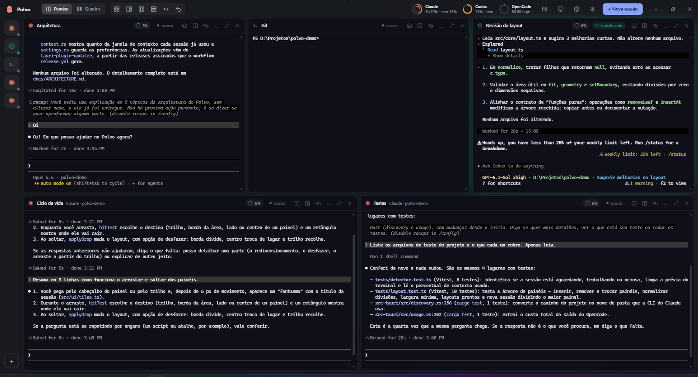
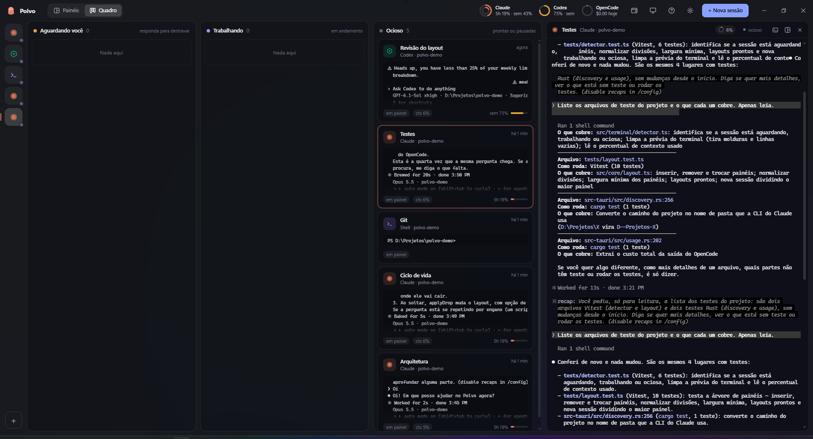
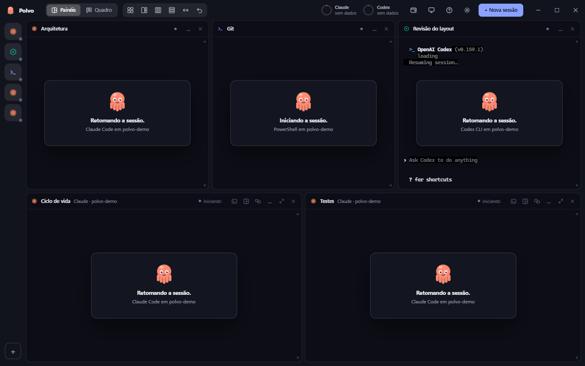
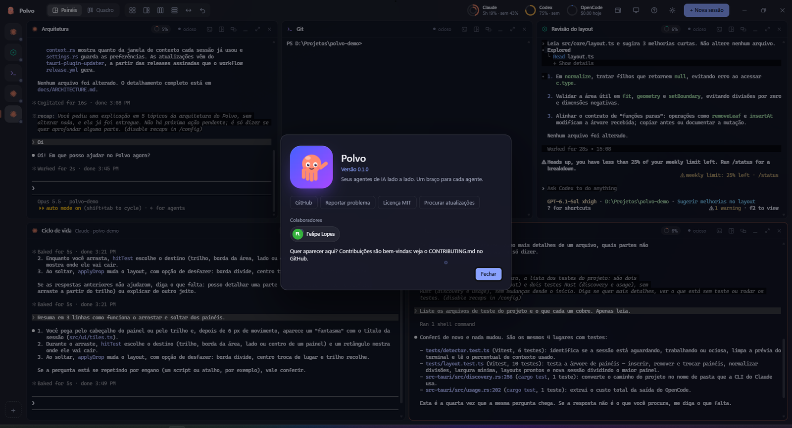
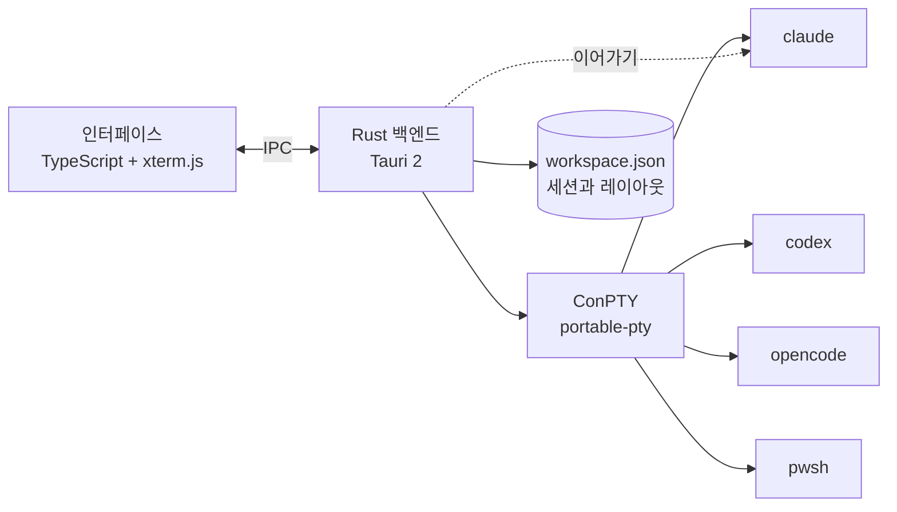

<p align="center">
  
</p>

<h1 align="center">Polvo</h1>

<p align="center"><b>AI 에이전트를 나란히.</b><br>
Claude Code, Codex, OpenCode와 셸을 한곳에 모아 주는 가볍고 아름다운 Windows 네이티브 정리 도구.<br>
에이전트마다 팔 하나씩. 🐙</p>

<p align="center">🌐 <a href="README.md">English</a> · <a href="README.pt-BR.md">Português</a> · <a href="README.es.md">Español</a> · <a href="README.fr.md">Français</a> · <a href="README.de.md">Deutsch</a> · <a href="README.it.md">Italiano</a> · <a href="README.ja.md">日本語</a> · <a href="README.zh-CN.md">简体中文</a> · <b>한국어</b> · <a href="README.ru.md">Русский</a></p>

<p align="center">
  <a href="https://github.com/felipeelopes/polvo/releases/latest">다운로드</a> ·
  <a href="#features">기능</a> ·
  <a href="docs/ARCHITECTURE.md">아키텍처 (포르투갈어)</a> ·
  <a href="#markdown-mermaid">Markdown과 Mermaid</a> ·
  <a href="CONTRIBUTING.md">기여하기 (포르투갈어)</a>
</p>

---



## 왜 Polvo인가요?

여러 에이전트를 동시에 돌리면 탭과 창이 금세 뒤죽박죽이 됩니다. Polvo는 모든 것을 한곳에 모읍니다:

- **드래그해서 끼워 넣는 패널**을 원하는 위치에 두고, 똑똑한 구분선으로 정리합니다.
- **떠날 때 모습 그대로 다시 열립니다**: 각 대화는 CLI 자체 기능으로 이어집니다 (`claude --resume`, `codex resume`, `opencode --session`).
- **사용 한도를 한눈에**: Claude와 Codex의 5시간 단위 및 주간 한도, OpenCode 비용.
- **상태별 보드**: 누가 작업 중이고 누가 **응답을 기다리는지** 바로 보입니다.

<a id="features"></a>

## 기능

| | |
|---|---|
| 🧩 **패널** | 헤더를 드래그해서 다른 패널의 가장자리에 놓으면 분할, 가운데에 놓으면 자리 바꾸기, 영역 가장자리에 놓으면 열/행 전체가 됩니다. |
| 📐 **똑똑한 크기 조절** | ⅓, ½, ⅔ 지점 자석, 다른 구분선과의 정렬, 함께 움직이는 정렬된 구분선, 최소 크기 보장, 터미널 열 × 행 실시간 표시. |
| ⚡ **편의 기능** | 격자, 메인 + 스택, 열, 행, 균등하게, 실행 취소, 최대화, 키보드 단축키. |
| 🗂️ **보드** | 자동 칸반: *응답 대기 중*, *작업 중*, *유휴*. 실시간 미리보기와 세션을 여는 서랍 제공. 열은 크기 조절과 접기가 가능하고, 채팅은 최대화할 수 있습니다. |
| 📁 **프로젝트** | 폴더 열기, 프로젝트 만들기 (`git init` 포함), 저장소 복제. “이 프로젝트만 보기”로 패널과 보드를 필터링하고, 프로젝트마다 배치를 따로 유지합니다. |
| 📝 **Markdown과 Mermaid** | 세션 옆에 문서 탭을 열어 Mermaid 다이어그램, 수식, 편집, 실시간 업데이트를 지원합니다. 터미널의 `.md`를 `Ctrl` + 클릭하면 파일이 열립니다. [아래에서 자세히](#markdown-mermaid). |
| 🗂️ **프로젝트별 사이드바** | 세션을 저장소별로 묶고 각 저장소의 worktree도 보여 줍니다. 채팅 이름은 CLI가 터미널에 설정한 제목을 따라갑니다. |
| ⚡ **묻지 않고 새 세션** | 채팅에 포커스가 있을 때 (`Ctrl+Shift+N`) 또는 프로젝트/worktree의 “+”로, 새 세션이 바로 그곳에서 열립니다. |
| 🎨 **`/rename`과 `/color`** | CLI에서 지정한 이름과 색이 Polvo의 패널 테두리와 사이드바에 표시됩니다. |
| 🖥️ **여러 창** | 창을 원하는 만큼 열고 각각 알맞은 모니터에 둘 수 있습니다. Polvo를 다시 열면 새 창이 만들어집니다. |
| 🔁 **자동 이어가기** | 열면 모든 창이 같은 모니터로 돌아오고 각 세션은 같은 대화를 이어갑니다 (`/resume` 후에도). |
| 📊 **사용 한도** | Claude는 링 두 개 (바깥은 주간, 안쪽은 5시간), Codex (세션 파일), OpenCode (`opencode stats`). |
| 🧠 **세션별 컨텍스트** | 각 패널에 대화가 컨텍스트 창을 얼마나 사용했는지 표시합니다. |
| ⬆️ **CLI 버전** | Claude Code, Codex, OpenCode의 새 버전이 나오면 사용량 팝업에서 알려 주고, 업데이트된 버전으로 세션을 다시 시작합니다. |
| 🎛️ **제공업체** | Claude, Codex, OpenCode가 설치되어 있어도 끌 수 있습니다. |
| 🌍 **10개 언어** | Português, English, Español, Français, Deutsch, Italiano, 日本語, 简体中文, 한국어, Русский. Windows 언어를 따르거나 설정에서 직접 고를 수 있습니다. |
| 🚀 **Windows와 함께 시작**하고 GitHub 릴리스에서 **자동으로 업데이트**됩니다. |

## 실제 모습

**상태별 보드**: 누가 작업 중이고, 누가 유휴 상태이며, 누가 응답을 기다리는지. 세션은 서랍에서 열립니다.



**자동 이어가기**: 열면 각 세션이 같은 대화로 돌아옵니다 (문어가 다시 끌어당겨 줍니다 🐙).



**정보**: git 기록에서 가져온 프로젝트 기여자.



<a id="markdown-mermaid"></a>

## Markdown과 Mermaid

에이전트는 계획, 명세, 보고서를 Markdown으로 작성합니다. Polvo는 앱을 떠나지 않고 이 파일들을 **세션 옆에** 엽니다:

- 터미널에 나타난 `.md` 경로를 **`Ctrl` + 클릭**하면 문서가 탭으로 열립니다.
- **읽기, 편집, 분할 모드** (CodeMirror 편집기). 코드 강조, 표, 각주, GitHub 알림 (`> [!NOTE]`), KaTeX 수식 (`$E = mc^2$`)을 지원합니다.
- **Mermaid 다이어그램**을 즉시 그립니다: 순서도, 시퀀스, 간트, 클래스, 상태, ER, 마인드맵 등.
- **실시간**: 에이전트가 파일을 바꾸면 문서도 자동으로 업데이트됩니다.

에이전트가 `PLANO.md`에 쓴 이런 블록이…

````markdown

````

…Polvo에서 (그리고 여기 GitHub에서도) 그림으로 나타납니다:


## 설치

1. [최신 릴리스](https://github.com/felipeelopes/polvo/releases/latest)에서 `.exe` 설치 프로그램을 내려받습니다.
2. `PATH`에 CLI가 하나 이상 있어야 합니다: [Claude Code](https://docs.claude.com/claude-code), [Codex CLI](https://github.com/openai/codex) 또는 [OpenCode](https://opencode.ai). PowerShell은 항상 사용할 수 있습니다.
3. Polvo를 열고 온보딩의 질문 3개에 답합니다.

Windows 10 또는 11이 필요합니다 (Mica 효과는 Windows 11에서 표시됩니다).

## 단축키

| 단축키 | 동작 |
|---|---|
| `Ctrl+Shift+N` | 새 세션 |
| `Ctrl+Shift+T` | 활성 세션 폴더에서 터미널 (PowerShell) |
| `Ctrl+Shift+1` / `Ctrl+Shift+2` | 패널 / 보드 |
| `Ctrl+Alt+←↑→↓` | 패널 간 포커스 이동 |
| `Ctrl+Alt+Shift+←↑→↓` | 패널 자리 바꾸기 |
| `Ctrl+Shift+M` | 패널 최대화 / 복원 |
| `Ctrl+Shift+Z` | 레이아웃 실행 취소 |
| `Ctrl +` / `Ctrl −` / `Ctrl 0` | 인터페이스 확대/축소 (VS Code와 동일) |
| 선택 후 `Ctrl+C` · `Ctrl+V` · 마우스 오른쪽 버튼 | 복사 · 붙여넣기 · 복사/붙여넣기 |

## 작동 방식



- **Tauri 2** (Rust + WebView2): 작은 설치 파일과 적은 메모리 사용량.
- [`portable-pty`](https://crates.io/crates/portable-pty)를 통한 **ConPTY**: 각 세션은 진짜 터미널입니다.
- **xterm.js** (WebGL)가 앱 테마로 터미널을 렌더링합니다.
- 백엔드는 세션을 `%APPDATA%\Polvo\workspace.json`에 저장하고, 나중에 이어갈 수 있도록 각 CLI의 ID를 찾아 둡니다.

자세한 내용은 [docs/ARCHITECTURE.md](docs/ARCHITECTURE.md) (포르투갈어)를 참고하세요.

## 개발

사전 요구 사항: [Rust](https://rustup.rs) (MSVC 툴체인), [Node 20+](https://nodejs.org), [pnpm](https://pnpm.io), Visual Studio Build Tools (C++).

```powershell
pnpm install
pnpm app:dev      # 자동 새로고침으로 앱 열기
pnpm test         # 레이아웃 엔진 테스트
pnpm check        # typecheck + 테스트 + rustfmt + clippy
pnpm app:build    # src-tauri/target/release/bundle에 설치 프로그램 생성
pnpm release      # 빌드, 서명 후 GitHub에 릴리스 게시 (docs/RELEASING.md 참고)
```

기여를 언제나 환영합니다: [CONTRIBUTING.md](CONTRIBUTING.md) (포르투갈어)를 읽어 주세요.

## 로드맵

- [ ] 세션을 한 창에서 다른 창으로 바로 드래그하기
- [ ] 테마 (라이트, 고대비)와 글꼴 설정
- [ ] 에이전트가 주의를 요청할 때 Windows 알림
- [ ] 사용자 지정 프로필 (모델, 환경 변수, WSL)
- [ ] 같은 프롬프트를 여러 세션에 보내기

## 라이선스

[MIT](LICENSE). Polvo는 독립 프로젝트이며 Anthropic, OpenAI, OpenCode와 관련이 없습니다.
