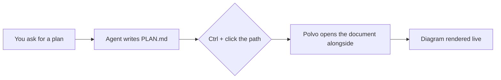
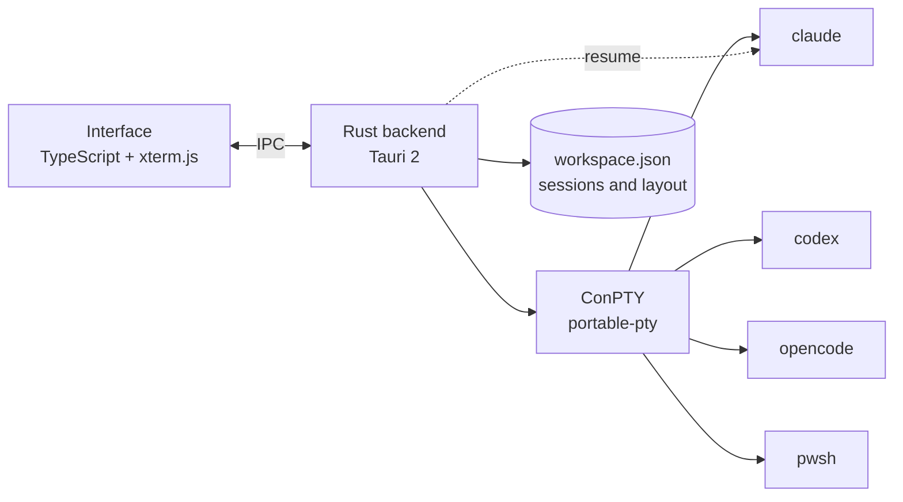

<p align="center">
  
</p>

<h1 align="center">Polvo</h1>

<p align="center"><b>Your AI agents, side by side.</b><br>
Claude Code, Codex, OpenCode and shells in one native, lightweight and good-looking organizer for Windows.<br>
One arm for each agent. 🐙</p>

<p align="center">🌐 <b>English</b> · <a href="README.pt-BR.md">Português</a> · <a href="README.es.md">Español</a> · <a href="README.fr.md">Français</a> · <a href="README.de.md">Deutsch</a> · <a href="README.it.md">Italiano</a> · <a href="README.ja.md">日本語</a> · <a href="README.zh-CN.md">简体中文</a> · <a href="README.ko.md">한국어</a> · <a href="README.ru.md">Русский</a></p>

<p align="center">
  <a href="https://github.com/felipeelopes/polvo/releases/latest">Download</a> ·
  <a href="#features">Features</a> ·
  <a href="docs/ARCHITECTURE.md">Architecture</a> ·
  <a href="#markdown-mermaid">Markdown and Mermaid</a> ·
  <a href="CONTRIBUTING.md">Contributing</a>
</p>

---


## Why Polvo?

Running several agents at once quickly turns into a mess of tabs and windows. Polvo brings it all together in one place:

- **Tiles you drag and snap** into any position, with smart dividers.
- **Reopens exactly as you left it**: each conversation is resumed by the CLI itself (`claude --resume`, `codex resume`, `opencode --session`).
- **Usage limits at a glance**: 5-hour and weekly windows for Claude and Codex, plus OpenCode costs.
- **Board by status**: see at a glance who is working and who is **waiting for you**.

<a id="features"></a>

## Features

| | |
|---|---|
| 🧩 **Tiles** | Drag by the header and drop on the edge of another tile to split it, in the center to swap, or on the edge of the area for a full column/row. |
| 📐 **Smart resizing** | Snaps to ⅓, ½ and ⅔, lines up with other dividers, aligned dividers move together, a guaranteed minimum size and live terminal columns × rows. |
| ⚡ **Quick layouts** | Grid, main + stack, columns, rows, equalize, undo, maximize, keyboard shortcuts. |
| 🗂️ **Board** | Automatic kanban: *Waiting for you*, *Working*, *Idle*, with a live preview and a drawer to open the session. Resizable, collapsible columns; the chat can be maximized. |
| 📁 **Projects** | Open a folder, create a project (with `git init`) or clone a repository. “Show only this project” filters Tiles and Board, and each project keeps its own layout. |
| 📝 **Markdown and Mermaid** | Document tabs next to your sessions, with Mermaid diagrams, math, editing and live reload. `Ctrl` + click a `.md` path in the terminal to open it. [See below](#markdown-mermaid). |
| 🗂️ **Project sidebar** | Sessions grouped by repository, with each one's worktrees. Chat names follow the title the CLI sets in the terminal. |
| ⚡ **New session, no questions asked** | With a chat focused (`Ctrl+Shift+N`) or from a project/worktree “+”, the new session opens right there. |
| 🎨 **`/rename` and `/color`** | The name and color set in the CLI show up in Polvo, on the tile border and in the sidebar. |
| 🖥️ **Multiple windows** | Open as many windows as you like and put each one on the right monitor. Launching Polvo again opens another window. |
| 🔁 **Automatic resume** | On launch, every window comes back on the same monitor and each session continues the same conversation (even after a `/resume`). |
| 📊 **Usage limits** | Claude with two rings (weekly outside, 5h inside), Codex (session files), OpenCode (`opencode stats`). |
| 🧠 **Per-session context** | Each tile shows how much of the context window the conversation has used. |
| ⬆️ **CLI versions** | The limits popup tells you when a new version of Claude Code, Codex or OpenCode is out and restarts your sessions on it. |
| 🎛️ **Providers** | Turn off Claude, Codex or OpenCode even if they're installed. |
| 🌍 **10 languages** | Português, English, Español, Français, Deutsch, Italiano, 日本語, 简体中文, 한국어 and Русский. Follows your Windows language or whatever you pick in Settings. |
| 🚀 **Starts with Windows** and **updates itself** from GitHub releases. |

## See it in action

**Board by status**: who is working, who is idle and who is waiting for you, with the session open in the drawer.


**Automatic resume**: on launch, each session comes back to the same conversation (the octopus pulls them back in 🐙).


**About**: project contributors pulled from the git history.


<a id="markdown-mermaid"></a>

## Markdown and Mermaid

Agents write plans, specs and reports in Markdown. Polvo opens those files **right next to your sessions**, without leaving the app:

- **`Ctrl` + click** any `.md` path that shows up in the terminal to open the document in a tab.
- **Read, edit and split modes** (CodeMirror editor), with code highlighting, tables, footnotes, GitHub alerts (`> [!NOTE]`) and KaTeX math (`$E = mc^2$`).
- **Mermaid diagrams** rendered on the fly: flowcharts, sequence, Gantt, class, state, ER, mindmap and more.
- **Live**: when the agent changes the file, the document updates by itself.

A block like this one, written by an agent in a `PLAN.md`…

````markdown

````

…shows up rendered in Polvo (and here on GitHub too):


## Installation

1. Download the `.exe` installer from the [latest release](https://github.com/felipeelopes/polvo/releases/latest).
2. Have at least one of the CLIs on your `PATH`: [Claude Code](https://docs.claude.com/claude-code), [Codex CLI](https://github.com/openai/codex) or [OpenCode](https://opencode.ai). PowerShell always works.
3. Open Polvo and answer the 3 onboarding questions.

Requires Windows 10 or 11 (the Mica effect shows up on Windows 11).

## Shortcuts

| Shortcut | Action |
|---|---|
| `Ctrl+Shift+N` | New session |
| `Ctrl+Shift+T` | Terminal (PowerShell) in the active session's folder |
| `Ctrl+Shift+1` / `Ctrl+Shift+2` | Tiles / Board |
| `Ctrl+Alt+←↑→↓` | Move focus between tiles |
| `Ctrl+Alt+Shift+←↑→↓` | Swap tile position |
| `Ctrl+Shift+M` | Maximize / restore the tile |
| `Ctrl+Shift+Z` | Undo layout |
| `Ctrl +` / `Ctrl −` / `Ctrl 0` | Interface zoom (like in VS Code) |
| `Ctrl+C` with a selection · `Ctrl+V` · right-click | Copy · paste · copy/paste |

## How it works



- **Tauri 2** (Rust + WebView2): small installer and low memory usage.
- **ConPTY** via [`portable-pty`](https://crates.io/crates/portable-pty): every session is a real terminal.
- **xterm.js** (WebGL) renders the terminal, using the app's theme.
- The backend stores sessions in `%APPDATA%\Polvo\workspace.json` and discovers each CLI's ids so it can resume them later.

Details in [docs/ARCHITECTURE.md](docs/ARCHITECTURE.md) (in Portuguese).

## Development

Prerequisites: [Rust](https://rustup.rs) (MSVC toolchain), [Node 20+](https://nodejs.org), [pnpm](https://pnpm.io) and the Visual Studio Build Tools (C++).

```powershell
pnpm install
pnpm app:dev      # opens the app with hot reload
pnpm test         # layout engine tests
pnpm check        # typecheck + tests + rustfmt + clippy
pnpm app:build    # builds the installers into src-tauri/target/release/bundle
pnpm release      # builds, signs and publishes the release on GitHub (see docs/RELEASING.md)
```

Contributions are very welcome: read [CONTRIBUTING.md](CONTRIBUTING.md) (in Portuguese).

### Contributors

<!-- contributors:start (gerado por scripts/contributors.mjs) -->
<table>
  <tr><td align="center"><a href="https://github.com/felipeelopes"><br><sub><b>Felipe Lopes</b></sub></a></td><td align="center"><a href="https://github.com/GabrielFranciscon"><br><sub><b>Gabriel Franciscon</b></sub></a></td></tr>
</table>
<!-- contributors:end -->

## Roadmap

- [ ] Drag a session straight from one window to another
- [ ] Themes (light, high contrast) and configurable font
- [ ] Windows notifications when an agent needs your attention
- [ ] Custom profiles (model, environment variables, WSL)
- [ ] Send the same prompt to several sessions

## License

[MIT](LICENSE). Polvo is an independent project, not affiliated with Anthropic, OpenAI or OpenCode.
