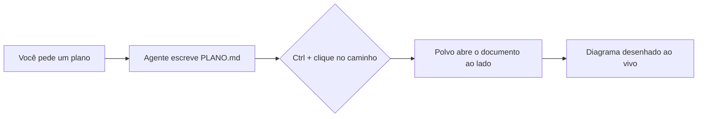
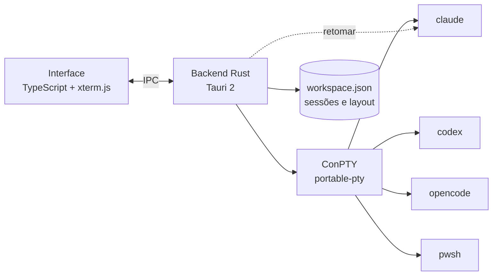

<p align="center">
  
</p>

<h1 align="center">Polvo</h1>

<p align="center"><b>Seus agentes de IA, lado a lado.</b><br>
Claude Code, Codex, OpenCode e shells num organizador nativo, leve e bonito para Windows.<br>
Um braço para cada agente. 🐙</p>

<p align="center">🌐 <a href="README.md">English</a> · <b>Português</b> · <a href="README.es.md">Español</a> · <a href="README.fr.md">Français</a> · <a href="README.de.md">Deutsch</a> · <a href="README.it.md">Italiano</a> · <a href="README.ja.md">日本語</a> · <a href="README.zh-CN.md">简体中文</a> · <a href="README.ko.md">한국어</a> · <a href="README.ru.md">Русский</a></p>

<p align="center">
  <a href="https://github.com/felipeelopes/polvo/releases/latest">Baixar</a> ·
  <a href="#recursos">Recursos</a> ·
  <a href="docs/ARCHITECTURE.md">Arquitetura</a> ·
  <a href="#markdown-e-mermaid">Markdown e Mermaid</a> ·
  <a href="CONTRIBUTING.md">Contribuir</a>
</p>

---


## Por que o Polvo?

Rodar vários agentes ao mesmo tempo vira uma bagunça de abas e janelas. O Polvo junta tudo num só lugar:

- **Painéis que você arrasta e encaixa** em qualquer posição, com divisórias inteligentes.
- **Reabre exatamente como você deixou**: cada conversa é retomada pelo próprio CLI (`claude --resume`, `codex resume`, `opencode --session`).
- **Limites de uso à vista**: janela de 5h e semanal do Claude e do Codex, custo do OpenCode.
- **Quadro por status**: veja de relance quem está trabalhando e quem está **aguardando você**.

## Recursos

| | |
|---|---|
| 🧩 **Painéis** | Arraste pelo cabeçalho e solte na borda de outro painel para dividir, no centro para trocar, na borda da área para uma coluna/linha inteira. |
| 📐 **Resize inteligente** | Ímã em ⅓, ½ e ⅔, alinhamento com outras divisórias, divisórias alinhadas que se movem juntas, tamanho mínimo garantido e colunas × linhas do terminal ao vivo. |
| ⚡ **Facilitadores** | Grade, principal + pilha, colunas, linhas, igualar, desfazer, maximizar, atalhos de teclado. |
| 🗂️ **Quadro** | Kanban automático: *Aguardando você*, *Trabalhando*, *Ocioso*, com prévia ao vivo e gaveta para abrir a sessão. Colunas redimensionáveis e recolhíveis; o chat pode ser maximizado. |
| 📁 **Projetos** | Abra uma pasta, crie um projeto (com `git init`) ou clone um repositório. “Ver só este projeto” filtra Painéis e Quadro, cada projeto com sua disposição. |
| 📝 **Markdown e Mermaid** | Abas de documentos ao lado das sessões, com diagramas Mermaid, fórmulas, edição e atualização ao vivo. `Ctrl` + clique num `.md` do terminal abre o arquivo. [Veja abaixo](#markdown-e-mermaid). |
| 🗂️ **Barra lateral por projeto** | Sessões agrupadas por repositório, com os worktrees de cada um. O nome do chat acompanha o título que o CLI define no terminal. |
| ⚡ **Nova sessão sem perguntas** | Com um chat em foco (`Ctrl+Shift+N`) ou pelo “+” de um projeto/worktree, a sessão nova abre direto ali. |
| 🎨 **`/rename` e `/color`** | O nome e a cor definidos no CLI aparecem no Polvo, na borda do painel e na barra lateral. |
| 🖥️ **Várias janelas** | Abra quantas janelas quiser e leve cada uma para o monitor certo. Abrir o Polvo de novo cria outra janela. |
| 🔁 **Retomada automática** | Ao abrir, todas as janelas voltam no mesmo monitor e cada sessão continua a mesma conversa (mesmo depois de um `/resume`). |
| 📊 **Limites de uso** | Claude com dois anéis (semanal por fora, 5h por dentro), Codex (arquivos de sessão), OpenCode (`opencode stats`). |
| 🧠 **Contexto por sessão** | Cada painel mostra quanto da janela de contexto a conversa já usou. |
| ⬆️ **Versões dos CLIs** | O popup de limites avisa quando há versão nova do Claude Code, Codex ou OpenCode e reinicia as sessões na versão atualizada. |
| 🎛️ **Fornecedores** | Desative Claude, Codex ou OpenCode mesmo que estejam instalados. |
| 🌍 **10 idiomas** | Português, English, Español, Français, Deutsch, Italiano, 日本語, 简体中文, 한국어 e Русский. Segue o idioma do Windows ou o que você escolher em Ajustes. |
| 🚀 **Inicia com o Windows** e **atualiza sozinho** a partir das releases do GitHub. |

## Veja em ação

**Quadro por status**: quem está trabalhando, quem está ocioso e quem está aguardando você, com a sessão aberta na gaveta.


**Retomada automática**: ao abrir, cada sessão volta na mesma conversa (o polvo puxa elas de volta 🐙).


**Sobre**: colaboradores do projeto vindos do histórico do git.


## Markdown e Mermaid

Os agentes escrevem planos, specs e relatórios em Markdown. O Polvo abre esses arquivos **ao lado das sessões**, sem sair do app:

- **`Ctrl` + clique** em qualquer caminho `.md` que apareça no terminal abre o documento numa aba.
- **Leitura, edição e modo dividido** (editor CodeMirror), com realce de código, tabelas, notas de rodapé, alertas do GitHub (`> [!NOTE]`) e fórmulas KaTeX (`$E = mc^2$`).
- **Diagramas Mermaid** desenhados na hora: fluxogramas, sequência, Gantt, classes, estados, ER, mindmap e outros.
- **Ao vivo**: quando o agente altera o arquivo, o documento se atualiza sozinho.

Um bloco como este, escrito por um agente num `PLANO.md`…

````markdown

````

…aparece desenhado no Polvo (e aqui no GitHub também):


## Instalação

1. Baixe o instalador `.exe` da [última release](https://github.com/felipeelopes/polvo/releases/latest).
2. Tenha pelo menos um dos CLIs no `PATH`: [Claude Code](https://docs.claude.com/claude-code), [Codex CLI](https://github.com/openai/codex) ou [OpenCode](https://opencode.ai). O PowerShell funciona sempre.
3. Abra o Polvo e responda às 3 perguntas do onboarding.

Requer Windows 10 ou 11 (o efeito Mica aparece no Windows 11).

## Atalhos

| Atalho | Ação |
|---|---|
| `Ctrl+Shift+N` | Nova sessão |
| `Ctrl+Shift+T` | Terminal (PowerShell) na pasta da sessão ativa |
| `Ctrl+Shift+1` / `Ctrl+Shift+2` | Painéis / Quadro |
| `Ctrl+Alt+←↑→↓` | Mover o foco entre painéis |
| `Ctrl+Alt+Shift+←↑→↓` | Trocar o painel de lugar |
| `Ctrl+Shift+M` | Maximizar / restaurar o painel |
| `Ctrl+Shift+Z` | Desfazer layout |
| `Ctrl +` / `Ctrl −` / `Ctrl 0` | Zoom da interface (como no VS Code) |
| `Ctrl+C` com seleção · `Ctrl+V` · botão direito | Copiar · colar · copiar/colar |

## Como funciona



- **Tauri 2** (Rust + WebView2): instalador pequeno e pouca memória.
- **ConPTY** via [`portable-pty`](https://crates.io/crates/portable-pty): cada sessão é um terminal real.
- **xterm.js** (WebGL) renderiza o terminal, com o tema do app.
- O backend guarda as sessões em `%APPDATA%\Polvo\workspace.json` e descobre os ids de cada CLI para retomar depois.

Detalhes em [docs/ARCHITECTURE.md](docs/ARCHITECTURE.md).

## Desenvolvimento

Pré-requisitos: [Rust](https://rustup.rs) (toolchain MSVC), [Node 20+](https://nodejs.org), [pnpm](https://pnpm.io) e as Build Tools do Visual Studio (C++).

```powershell
pnpm install
pnpm app:dev      # abre o app com recarregamento automático
pnpm test         # testes do motor de layout
pnpm check        # typecheck + testes + rustfmt + clippy
pnpm app:build    # gera os instaladores em src-tauri/target/release/bundle
pnpm release      # compila, assina e publica a release no GitHub (veja docs/RELEASING.md)
```

Contribuições são muito bem-vindas: leia o [CONTRIBUTING.md](CONTRIBUTING.md).

### Contribuidores

<!-- contributors:start (gerado por scripts/contributors.mjs) -->
<table>
  <tr><td align="center"><a href="https://github.com/felipeelopes"><br><sub><b>Felipe Lopes</b></sub></a></td><td align="center"><a href="https://github.com/GabrielFranciscon"><br><sub><b>Gabriel Franciscon</b></sub></a></td></tr>
</table>
<!-- contributors:end -->

## Roadmap

- [ ] Arrastar uma sessão diretamente de uma janela para outra
- [ ] Temas (claro, alto contraste) e fonte configurável
- [ ] Notificações do Windows quando um agente pedir sua atenção
- [ ] Perfis personalizados (modelo, variáveis de ambiente, WSL)
- [ ] Enviar o mesmo prompt para várias sessões

## Licença

[MIT](LICENSE). Polvo é um projeto independente, sem vínculo com Anthropic, OpenAI ou OpenCode.

