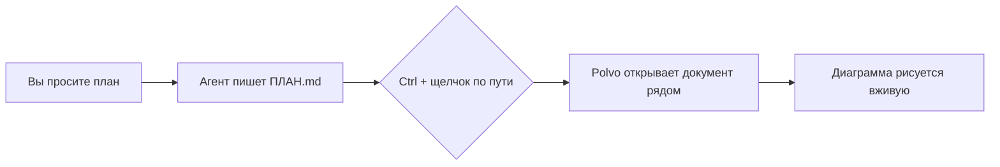
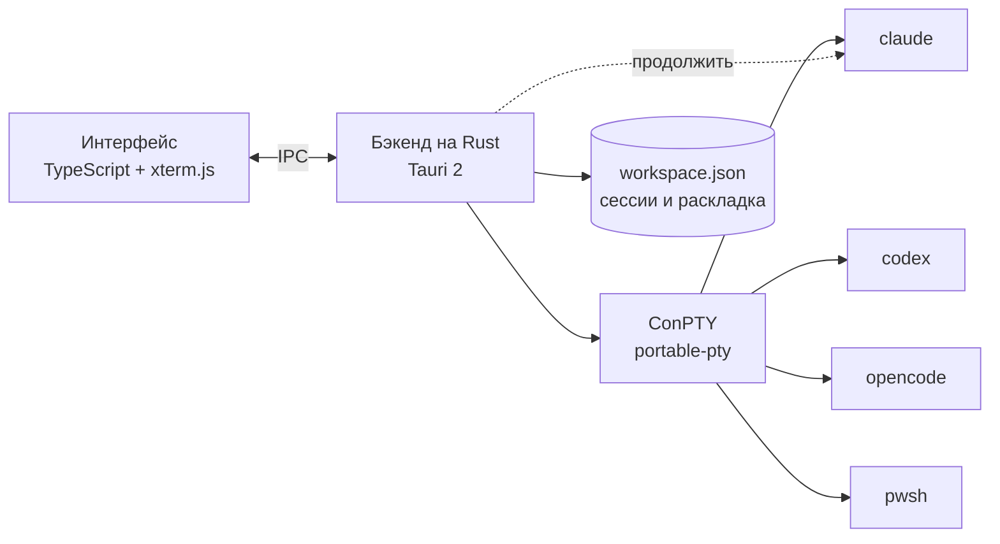

<p align="center">
  
</p>

<h1 align="center">Polvo</h1>

<p align="center"><b>Ваши ИИ-агенты бок о бок.</b><br>
Claude Code, Codex, OpenCode и оболочки в нативном, лёгком и красивом органайзере для Windows.<br>
По щупальцу на каждого агента. 🐙</p>

<p align="center">🌐 <a href="README.md">English</a> · <a href="README.pt-BR.md">Português</a> · <a href="README.es.md">Español</a> · <a href="README.fr.md">Français</a> · <a href="README.de.md">Deutsch</a> · <a href="README.it.md">Italiano</a> · <a href="README.ja.md">日本語</a> · <a href="README.zh-CN.md">简体中文</a> · <a href="README.ko.md">한국어</a> · <b>Русский</b></p>

<p align="center">
  <a href="https://github.com/felipeelopes/polvo/releases/latest">Скачать</a> ·
  <a href="#features">Возможности</a> ·
  <a href="docs/ARCHITECTURE.md">Архитектура (на португальском)</a> ·
  <a href="#markdown-mermaid">Markdown и Mermaid</a> ·
  <a href="CONTRIBUTING.md">Участие (на португальском)</a>
</p>

---


## Зачем нужен Polvo?

Когда запускаешь несколько агентов одновременно, всё превращается в хаос из вкладок и окон. Polvo собирает всё в одном месте:

- **Панели, которые можно перетаскивать и пристыковывать** в любое место, с умными разделителями.
- **Открывается ровно так, как вы оставили**: каждый разговор продолжается средствами самого CLI (`claude --resume`, `codex resume`, `opencode --session`).
- **Лимиты использования на виду**: 5-часовое и недельное окно Claude и Codex, расходы OpenCode.
- **Доска по статусу**: с первого взгляда видно, кто работает, а кто **ждёт вас**.

<a id="features"></a>
## Возможности

| | |
|---|---|
| 🧩 **Панели** | Перетащите за заголовок и отпустите у края другой панели, чтобы разделить её, в центре — чтобы поменять местами, у края области — чтобы получить целый столбец/строку. |
| 📐 **Умное изменение размеров** | Притяжение к ⅓, ½ и ⅔, выравнивание по другим разделителям, выровненные разделители двигаются вместе, гарантированный минимальный размер и столбцы × строки терминала в реальном времени. |
| ⚡ **Быстрые раскладки** | Сетка, главная + стопка, столбцы, строки, выравнивание, отмена, разворачивание, сочетания клавиш. |
| 🗂️ **Доска** | Автоматический канбан: *Ждут вас*, *Работают*, *Простаивают*, с живым предпросмотром и боковой панелью для открытия сессии. Столбцы можно растягивать и сворачивать; чат можно развернуть. |
| 📁 **Проекты** | Откройте папку, создайте проект (с `git init`) или клонируйте репозиторий. «Показать только этот проект» фильтрует Панели и Доску, у каждого проекта своя раскладка. |
| 📝 **Markdown и Mermaid** | Вкладки документов рядом с сессиями, с диаграммами Mermaid, формулами, редактированием и обновлением в реальном времени. `Ctrl` + щелчок по `.md` в терминале открывает файл. [Подробнее ниже](#markdown-mermaid). |
| 🗂️ **Боковая панель по проектам** | Сессии сгруппированы по репозиториям, вместе с их worktree. Название чата повторяет заголовок, который CLI задаёт в терминале. |
| ⚡ **Новая сессия без вопросов** | Из активного чата (`Ctrl+Shift+N`) или через «+» у проекта/worktree новая сессия открывается прямо там. |
| 🎨 **`/rename` и `/color`** | Имя и цвет, заданные в CLI, появляются в Polvo — на рамке панели и в боковой панели. |
| 🖥️ **Несколько окон** | Открывайте сколько угодно окон и переносите каждое на нужный монитор. Повторный запуск Polvo создаёт ещё одно окно. |
| 🔁 **Автоматическое продолжение** | При запуске все окна возвращаются на тот же монитор, и каждая сессия продолжает тот же разговор (даже после `/resume`). |
| 📊 **Лимиты использования** | Claude с двумя кольцами (недельное снаружи, 5-часовое внутри), Codex (файлы сессий), OpenCode (`opencode stats`). |
| 🧠 **Контекст каждой сессии** | Каждая панель показывает, какую часть окна контекста разговор уже использовал. |
| ⬆️ **Версии CLI** | Всплывающее окно лимитов сообщает о новой версии Claude Code, Codex или OpenCode и перезапускает сессии на обновлённой версии. |
| 🎛️ **Провайдеры** | Отключайте Claude, Codex или OpenCode, даже если они установлены. |
| 🌍 **10 языков** | Português, English, Español, Français, Deutsch, Italiano, 日本語, 简体中文, 한국어 и Русский. Следует языку Windows или тому, что вы выберете в Настройках. |
| 🚀 **Запускается вместе с Windows** и **обновляется сам** из релизов на GitHub. |

## В деле

**Доска по статусу**: кто работает, кто простаивает и кто ждёт вас, с сессией, открытой в боковой панели.


**Автоматическое продолжение**: при запуске каждая сессия возвращается к тому же разговору (осьминог тянет их обратно 🐙).


**О программе**: участники проекта из истории git.


<a id="markdown-mermaid"></a>
## Markdown и Mermaid

Агенты пишут планы, спецификации и отчёты в Markdown. Polvo открывает эти файлы **рядом с сессиями**, не выходя из приложения:

- **`Ctrl` + щелчок** по любому пути `.md` в терминале открывает документ во вкладке.
- **Чтение, редактирование и разделённый режим** (редактор CodeMirror), с подсветкой кода, таблицами, сносками, предупреждениями GitHub (`> [!NOTE]`) и формулами KaTeX (`$E = mc^2$`).
- **Диаграммы Mermaid** рисуются сразу: блок-схемы, последовательности, Гант, классы, состояния, ER, mindmap и другие.
- **В реальном времени**: когда агент меняет файл, документ обновляется сам.

Такой блок, написанный агентом в `ПЛАН.md`…

````markdown

````

…отображается в Polvo в виде диаграммы (и здесь, на GitHub, тоже):


## Установка

1. Скачайте установщик `.exe` из [последнего релиза](https://github.com/felipeelopes/polvo/releases/latest).
2. Убедитесь, что хотя бы один из CLI есть в `PATH`: [Claude Code](https://docs.claude.com/claude-code), [Codex CLI](https://github.com/openai/codex) или [OpenCode](https://opencode.ai). PowerShell работает всегда.
3. Откройте Polvo и ответьте на 3 вопроса начальной настройки.

Требуется Windows 10 или 11 (эффект Mica доступен в Windows 11).

## Сочетания клавиш

| Сочетание | Действие |
|---|---|
| `Ctrl+Shift+N` | Новая сессия |
| `Ctrl+Shift+T` | Терминал (PowerShell) в папке активной сессии |
| `Ctrl+Shift+1` / `Ctrl+Shift+2` | Панели / Доска |
| `Ctrl+Alt+←↑→↓` | Перемещать фокус между панелями |
| `Ctrl+Alt+Shift+←↑→↓` | Поменять панель местами |
| `Ctrl+Shift+M` | Развернуть / восстановить панель |
| `Ctrl+Shift+Z` | Отменить раскладку |
| `Ctrl +` / `Ctrl −` / `Ctrl 0` | Масштаб интерфейса (как в VS Code) |
| `Ctrl+C` с выделением · `Ctrl+V` · правая кнопка мыши | Копировать · вставить · копировать/вставить |

## Как это работает



- **Tauri 2** (Rust + WebView2): маленький установщик и мало памяти.
- **ConPTY** через [`portable-pty`](https://crates.io/crates/portable-pty): каждая сессия — настоящий терминал.
- **xterm.js** (WebGL) отрисовывает терминал в теме приложения.
- Бэкенд хранит сессии в `%APPDATA%\Polvo\workspace.json` и определяет id каждого CLI, чтобы потом продолжить работу.

Подробности в [docs/ARCHITECTURE.md](docs/ARCHITECTURE.md) (на португальском).

## Разработка

Требования: [Rust](https://rustup.rs) (тулчейн MSVC), [Node 20+](https://nodejs.org), [pnpm](https://pnpm.io) и Build Tools для Visual Studio (C++).

```powershell
pnpm install
pnpm app:dev      # открывает приложение с автоматической перезагрузкой
pnpm test         # тесты движка раскладки
pnpm check        # typecheck + тесты + rustfmt + clippy
pnpm app:build    # собирает установщики в src-tauri/target/release/bundle
pnpm release      # компилирует, подписывает и публикует релиз на GitHub (см. docs/RELEASING.md)
```

Мы очень рады вашему участию: прочитайте [CONTRIBUTING.md](CONTRIBUTING.md) (на португальском).

### Участники

<!-- contributors:start (gerado por scripts/contributors.mjs) -->
<table>
  <tr><td align="center"><a href="https://github.com/felipeelopes"><br><sub><b>Felipe Lopes</b></sub></a></td><td align="center"><a href="https://github.com/GabrielFranciscon"><br><sub><b>Gabriel Franciscon</b></sub></a></td></tr>
</table>
<!-- contributors:end -->

## Планы

- [ ] Перетаскивание сессии напрямую из одного окна в другое
- [ ] Темы (светлая, высококонтрастная) и настраиваемый шрифт
- [ ] Уведомления Windows, когда агенту нужно ваше внимание
- [ ] Пользовательские профили (модель, переменные окружения, WSL)
- [ ] Отправка одного промпта в несколько сессий

## Лицензия

[MIT](LICENSE). Polvo — независимый проект, не связанный с Anthropic, OpenAI или OpenCode.
