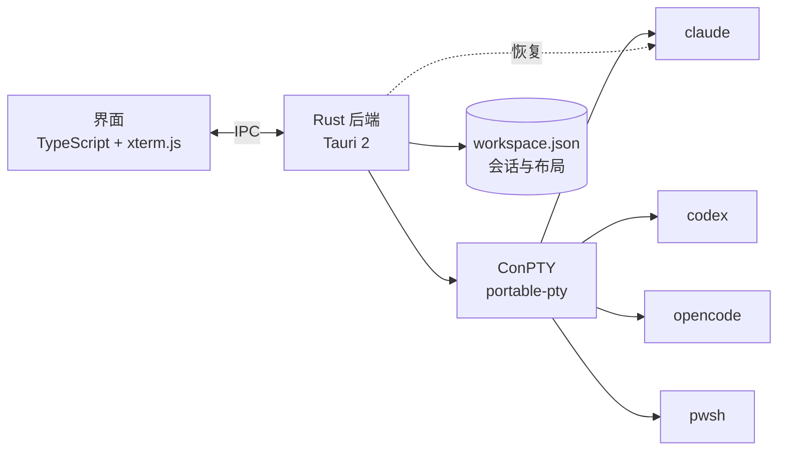

<p align="center">
  
</p>

<h1 align="center">Polvo</h1>

<p align="center"><b>让你的 AI 智能体并排工作。</b><br>
在一个原生、轻量又美观的 Windows 管理器中同时运行 Claude Code、Codex、OpenCode 和 shell。<br>
每个智能体一条触手。🐙</p>

<p align="center">🌐 <a href="README.md">English</a> · <a href="README.pt-BR.md">Português</a> · <a href="README.es.md">Español</a> · <a href="README.fr.md">Français</a> · <a href="README.de.md">Deutsch</a> · <a href="README.it.md">Italiano</a> · <a href="README.ja.md">日本語</a> · <b>简体中文</b> · <a href="README.ko.md">한국어</a> · <a href="README.ru.md">Русский</a></p>

<p align="center">
  <a href="https://github.com/felipeelopes/polvo/releases/latest">下载</a> ·
  <a href="#features">功能</a> ·
  <a href="docs/ARCHITECTURE.md">架构 (葡萄牙语)</a> ·
  <a href="#markdown-mermaid">Markdown 与 Mermaid</a> ·
  <a href="CONTRIBUTING.md">参与贡献 (葡萄牙语)</a>
</p>

---


## 为什么选择 Polvo?

同时运行多个智能体,很快就会被一堆标签页和窗口淹没。Polvo 把一切集中到一个地方:

- **可拖放停靠的面板**,任意摆放,配有智能分隔条。
- **按你离开时的样子重新打开**:每个对话都由 CLI 自身恢复 (`claude --resume`、`codex resume`、`opencode --session`)。
- **用量限制一目了然**:Claude 和 Codex 的 5 小时窗口与每周限制,以及 OpenCode 的花费。
- **按状态分组的看板**:一眼看出谁在工作、谁在**等待你回复**。

<a id="features"></a>

## 功能

| | |
|---|---|
| 🧩 **面板** | 拖动标题栏,放到另一个面板的边缘以拆分,放到中间以交换,放到区域边缘以创建整列/整行。 |
| 📐 **智能调整大小** | 在 ⅓、½ 和 ⅔ 处吸附,与其他分隔条对齐,对齐的分隔条一起移动,保证最小尺寸,实时显示终端的列 × 行。 |
| ⚡ **快捷布局** | 网格、主窗格 + 堆叠、列、行、均分、撤销、最大化、键盘快捷键。 |
| 🗂️ **看板** | 自动看板:*等待你回复*、*工作中*、*空闲*,带实时预览和用于打开会话的抽屉。列可调整大小和收起;对话可最大化。 |
| 📁 **项目** | 打开文件夹、创建项目 (带 `git init`) 或克隆仓库。“仅查看此项目”可筛选面板和看板,每个项目保留各自的布局。 |
| 📝 **Markdown 与 Mermaid** | 在会话旁打开文档标签页,支持 Mermaid 图表、公式、编辑和实时更新。在终端中 `Ctrl` + 单击 `.md` 即可打开文件。[详见下文](#markdown-mermaid)。 |
| 🗂️ **按项目分组的侧边栏** | 会话按仓库分组,并显示各自的 worktree。对话名称跟随 CLI 在终端中设置的标题。 |
| ⚡ **无需询问即可新建会话** | 聚焦某个对话时 (`Ctrl+Shift+N`),或通过项目/worktree 的“+”,新会话会直接在那里打开。 |
| 🎨 **`/rename` 与 `/color`** | 在 CLI 中设置的名称和颜色会显示在 Polvo 的面板边框和侧边栏中。 |
| 🖥️ **多窗口** | 想开几个窗口就开几个,并把每个放到合适的显示器上。再次打开 Polvo 会创建一个新窗口。 |
| 🔁 **自动恢复** | 启动时,所有窗口都回到原来的显示器,每个会话继续同一个对话 (即使在 `/resume` 之后)。 |
| 📊 **用量限制** | Claude 显示两个圆环 (外环每周,内环 5 小时),Codex (会话文件),OpenCode (`opencode stats`)。 |
| 🧠 **每个会话的上下文** | 每个面板都显示对话已使用了多少上下文窗口。 |
| ⬆️ **CLI 版本** | Claude Code、Codex 或 OpenCode 有新版本时,用量弹窗会提醒你,并用更新后的版本重启会话。 |
| 🎛️ **提供商** | 即使已安装,也可以停用 Claude、Codex 或 OpenCode。 |
| 🌍 **10 种语言** | Português、English、Español、Français、Deutsch、Italiano、日本語、简体中文、한국어 和 Русский。跟随 Windows 语言,或在设置中自行选择。 |
| 🚀 **随 Windows 启动**,并从 GitHub 发布版**自动更新**。 |

## 实际效果

**按状态分组的看板**:谁在工作、谁空闲、谁在等待你回复,会话在抽屉中打开。


**自动恢复**:启动时,每个会话都回到同一个对话 (章鱼把它们拉了回来 🐙)。


**关于**:来自 git 历史的项目贡献者。


<a id="markdown-mermaid"></a>

## Markdown 与 Mermaid

智能体用 Markdown 写计划、规格说明和报告。Polvo 会**在会话旁边**打开这些文件,无需离开应用:

- 在终端中出现的任意 `.md` 路径上 **`Ctrl` + 单击**,即可在标签页中打开文档。
- **阅读、编辑和分栏模式** (CodeMirror 编辑器),支持代码高亮、表格、脚注、GitHub 提示块 (`> [!NOTE]`) 和 KaTeX 公式 (`$E = mc^2$`)。
- **Mermaid 图表**即时绘制:流程图、时序图、甘特图、类图、状态图、ER 图、思维导图等。
- **实时更新**:智能体修改文件时,文档会自动刷新。

像这样一个由智能体写在 `PLANO.md` 中的代码块…

````markdown

````

…会在 Polvo 中 (在 GitHub 上也一样) 渲染成图表:


## 安装

1. 从[最新发布版](https://github.com/felipeelopes/polvo/releases/latest)下载 `.exe` 安装程序。
2. 确保 `PATH` 中至少有一个 CLI:[Claude Code](https://docs.claude.com/claude-code)、[Codex CLI](https://github.com/openai/codex) 或 [OpenCode](https://opencode.ai)。PowerShell 始终可用。
3. 打开 Polvo,回答引导中的 3 个问题。

需要 Windows 10 或 11 (Mica 效果仅在 Windows 11 上显示)。

## 快捷键

| 快捷键 | 操作 |
|---|---|
| `Ctrl+Shift+N` | 新建会话 |
| `Ctrl+Shift+T` | 在当前会话的文件夹中打开终端 (PowerShell) |
| `Ctrl+Shift+1` / `Ctrl+Shift+2` | 面板 / 看板 |
| `Ctrl+Alt+←↑→↓` | 在面板间移动焦点 |
| `Ctrl+Alt+Shift+←↑→↓` | 交换面板位置 |
| `Ctrl+Shift+M` | 最大化 / 还原面板 |
| `Ctrl+Shift+Z` | 撤销布局 |
| `Ctrl +` / `Ctrl −` / `Ctrl 0` | 界面缩放 (与 VS Code 相同) |
| 选中时 `Ctrl+C` · `Ctrl+V` · 右键 | 复制 · 粘贴 · 复制/粘贴 |

## 工作原理



- **Tauri 2** (Rust + WebView2):安装包小,内存占用低。
- 通过 [`portable-pty`](https://crates.io/crates/portable-pty) 使用 **ConPTY**:每个会话都是一个真正的终端。
- **xterm.js** (WebGL) 以应用主题渲染终端。
- 后端将会话保存在 `%APPDATA%\Polvo\workspace.json` 中,并识别每个 CLI 的 id 以便稍后恢复。

详情见 [docs/ARCHITECTURE.md](docs/ARCHITECTURE.md) (葡萄牙语)。

## 开发

前置条件:[Rust](https://rustup.rs) (MSVC 工具链)、[Node 20+](https://nodejs.org)、[pnpm](https://pnpm.io) 以及 Visual Studio 生成工具 (C++)。

```powershell
pnpm install
pnpm app:dev      # 以自动重载方式打开应用
pnpm test         # 布局引擎测试
pnpm check        # typecheck + 测试 + rustfmt + clippy
pnpm app:build    # 在 src-tauri/target/release/bundle 中生成安装程序
pnpm release      # 编译、签名并在 GitHub 上发布 (见 docs/RELEASING.md)
```

非常欢迎贡献:请阅读 [CONTRIBUTING.md](CONTRIBUTING.md) (葡萄牙语)。

### 贡献者

<!-- contributors:start (gerado por scripts/contributors.mjs) -->
<table>
  <tr><td align="center"><a href="https://github.com/felipeelopes"><br><sub><b>Felipe Lopes</b></sub></a></td><td align="center"><a href="https://github.com/GabrielFranciscon"><br><sub><b>Gabriel Franciscon</b></sub></a></td></tr>
</table>
<!-- contributors:end -->

## 路线图

- [ ] 直接把会话从一个窗口拖到另一个窗口
- [ ] 主题 (浅色、高对比度) 和可配置字体
- [ ] 智能体需要你关注时发送 Windows 通知
- [ ] 自定义配置 (模型、环境变量、WSL)
- [ ] 向多个会话发送同一个提示词

## 许可证

[MIT](LICENSE)。Polvo 是一个独立项目,与 Anthropic、OpenAI 或 OpenCode 无关。
